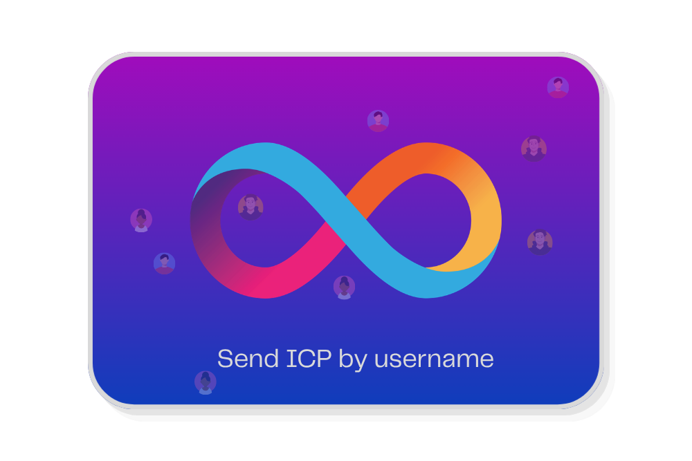
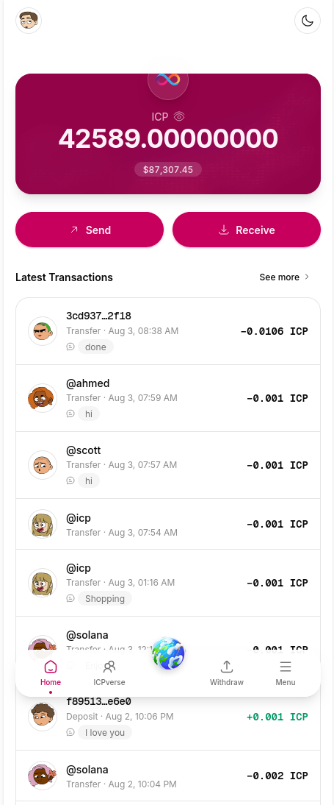
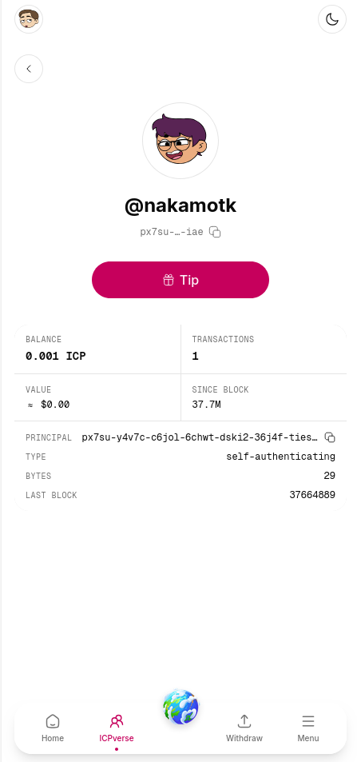
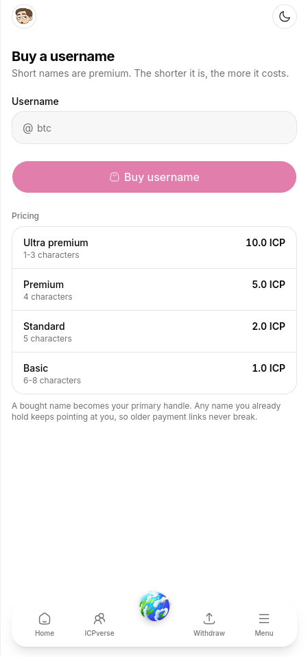

<p align="center">
  
</p>

<h1 align="center">ICPay</h1>

<p align="center">
  Send ICP by username instead of a 63-character principal.
</p>

<p align="center">
  <a href="https://icpay.app">icpay.app</a> ·
  <a href="https://63dke-waaaa-aaaan-q6mvq-cai.icp0.io">on-chain</a> ·
  <a href="https://icpay.app/transparency">transparency</a>
</p>

ICPay is a custodial wallet on the [Internet Computer](https://internetcomputer.org).
You sign in with Internet Identity — no password, no seed phrase — claim a
handle, and people pay you at `@yourname`.

## Screenshots

<table>
  <tr>
    <td width="50%"></td>
    <td width="50%"></td>
  </tr>
  <tr>
    <td align="center"><b>Wallet</b><br>Balance, and every transfer with its memo.</td>
    <td align="center"><b>Tip anyone</b><br>A public page per handle, showing its on-chain principal.</td>
  </tr>
  <tr>
    <td width="50%"></td>
    <td width="50%"></td>
  </tr>
  <tr>
    <td align="center"><b>ICPverse</b><br>Find people by handle instead of principal.</td>
    <td align="center"><b>Short handles</b><br>Claim 5–8 characters free, or buy a shorter one.</td>
  </tr>
</table>

## Read this before you use it

ICPay is **custodial**. Your ICP sits in a subaccount of the backend canister
derived from your principal, so the canister's code — not your signature alone —
is what authorises a spend.

It has **not been audited**. One principal controls the canister and can upgrade
it. Nothing here is a guarantee, and there is no insurance and no recourse.

The [Transparency page](https://icpay.app/transparency) states exactly
what the operator can and cannot do, with the addresses to verify each claim
against the chain yourself.

## Canisters

| | |
|---|---|
| Backend | `6vbhm-nqaaa-aaaan-q6muq-cai` |
| Frontend assets | `63dke-waaaa-aaaan-q6mvq-cai` |
| ICP ledger | `ryjl3-tyaaa-aaaaa-aaaba-cai` |

## Layout

```
backend/    Motoko canister — api → services → repositories → storage
frontend/   Next.js App Router, static export
```

The layering is enforced by convention: API modules take a `caller` and delegate;
services hold the business rules; repositories own the data structures. Fund
movement lives in `backend/src/services/TransferService.mo` and
`WithdrawService.mo` — both derive the source account from the caller, which is
the property that makes "no admin can move your funds" true rather than merely
claimed.

## Develop

```bash
# backend
cd backend
dfx start --background
dfx deploy
bash scripts/run-tests.sh

# frontend
cd frontend
npm install
npm run dev
```

## Contributing

See [CONTRIBUTING.md](CONTRIBUTING.md). The short version: open an issue before
writing anything that touches fund movement, username ownership or stored state.

## Security

Report vulnerabilities at
[GitHub issues](https://github.com/prasangapokharel/ICPay/issues). There is no
bug bounty and no private disclosure channel — **an issue is public**, so if a
finding would put user funds at immediate risk, please weigh that before filing.
Full policy in [SECURITY.md](SECURITY.md).

## License

[MIT](LICENSE)
