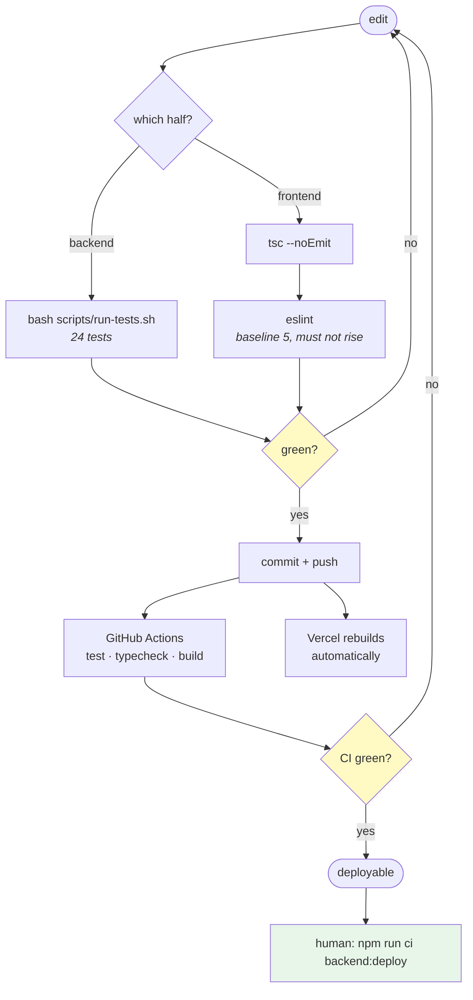
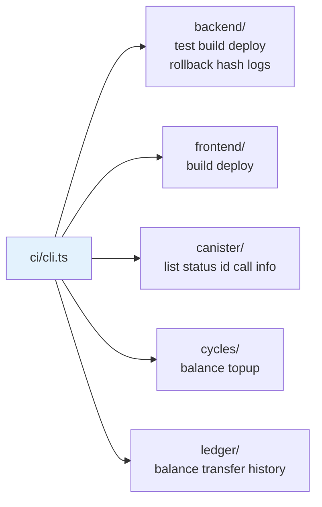
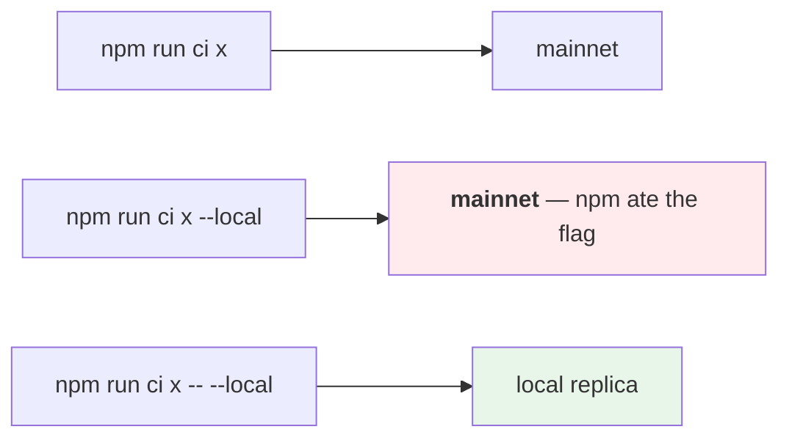
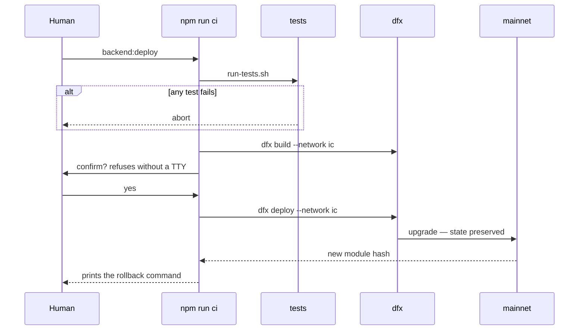
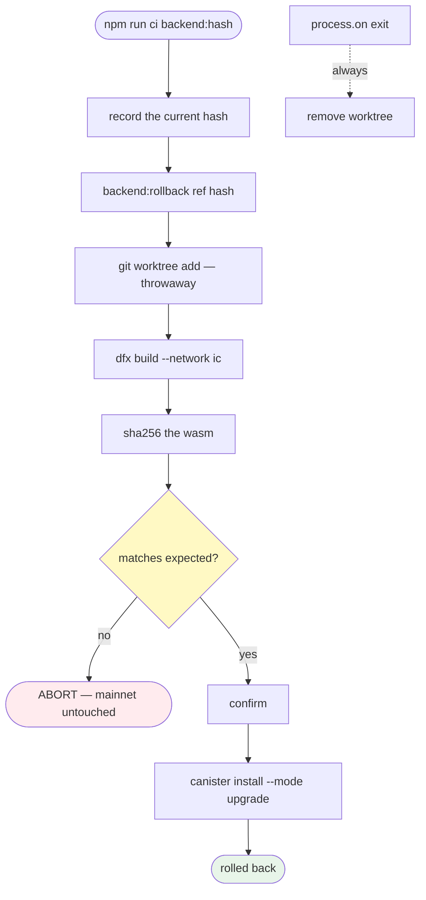
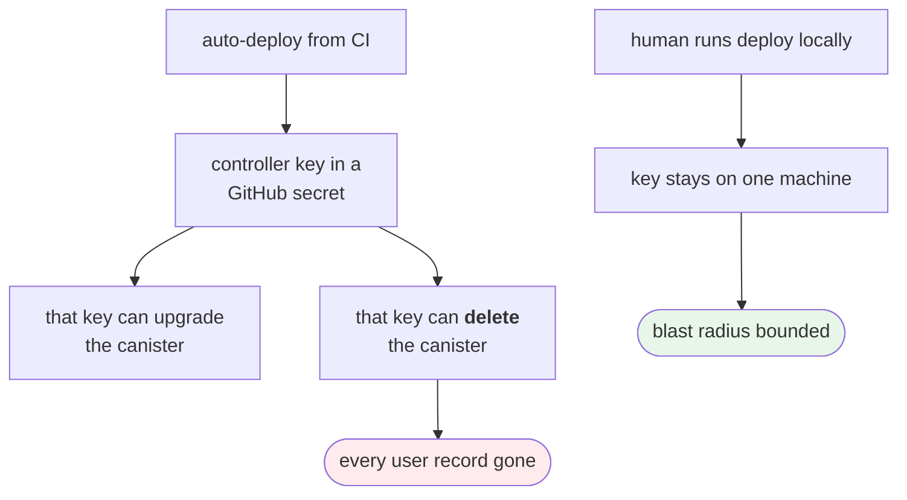
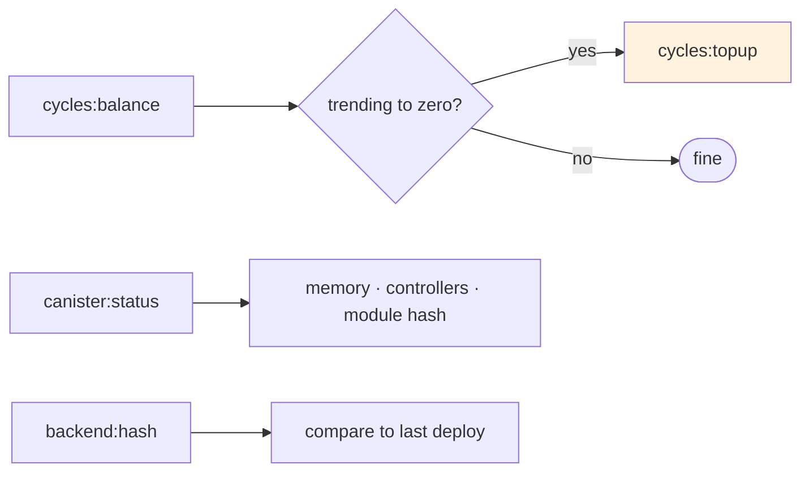

# Development and operations workflow

How code gets from a local edit to mainnet, and what stops a bad one.

---

## Change lifecycle

Frontend and backend deploy on **different triggers**. Vercel rebuilds itself on
every push to `main`. The canister only changes when a human runs the deploy
command. They can drift, and a frontend expecting a method the deployed canister
does not have will fail at runtime — ship backend first when adding an endpoint.

---

## The CI command surface

One entry point, `npm run ci <group>:<command>`, from the repo root.

**The bare `--` is required.** npm consumes a lone `--local` as its own flag and
leaves no recoverable trace, so the command quietly hits mainnet. Every run
prints a banner naming the network it actually resolved — that banner is the
safety net, so read it.

---

## Deploy

Printing the rollback command on success means the escape hatch exists before
it is needed, not after.

---

## Rollback

**Why rebuild rather than download.** The IC keeps no archive of past wasms. A
module hash is a fingerprint, not an artifact — the only way back to old code is
to rebuild it from its commit and prove the hash matches.

Build with `--network ic`. `dfx build --check` writes to `.dfx/local`, which is
not what installs on mainnet.

Cleanup is registered on `process.on("exit")`, not in a `finally` — every guard
above exits via `process.exit`, which unwinds no `finally` and would leak the
worktree. That bug was real and is fixed.

**Your working tree is never touched.** The build happens in a temporary
worktree, uncommitted changes included.

---

## Why CI does not deploy

CI runs tests, typecheck and build. Nothing else. This is a deliberate trade of
convenience for a bounded blast radius.

---

## Operational watch list

**Cycles are an availability risk, not a bill.** At zero the canister is deleted
and every user record with it. Queries are free on the IC; only update calls and
idle burn (~45k cycles/s) cost anything, so a balance drifting down while nothing
is happening is normal.
