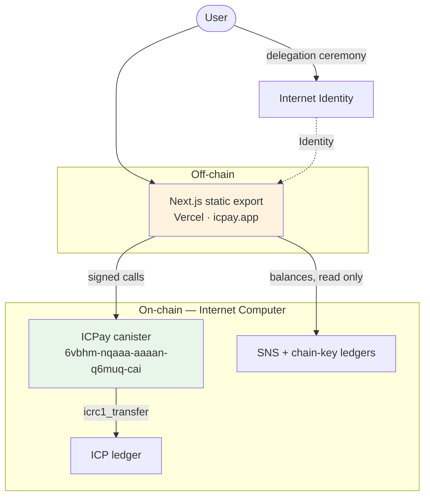

# Architecture — index

Every diagram for ICPay, grouped by what it explains. Each file is Mermaid, so
it renders directly on GitHub with no build step.

Everything here was read off the code and the live deployment. Where a claim
could not be verified it is marked as such rather than assumed.

---

## Files

| File | What it answers |
|---|---|
| [`system/overview.md`](../system/overview.md) | What runs where, trust boundaries, custody model, environments |
| [`backend/backend.md`](../backend/backend.md) | Motoko layering, module wiring, endpoints, transfer and deposit sequences |
| [`frontend/frontend.md`](../frontend/frontend.md) | Route groups, auth flow, SWR caching, build and deploy |
| [`flows/flows.md`](../flows/flows.md) | Onboarding, send, receive, withdraw, buy a username, multi-token, profile |
| [`data/data-model.md`](../data/data-model.md) | Entities, storage maps, transaction lifecycle, what is public and permanent |
| [`1_workflow.md/workflow.md`](../1_workflow.md/workflow.md) | Change lifecycle, the CI command surface, deploy, rollback |

---

## The one-diagram version

---

## Five things that are easy to get wrong

1. **Only the backend is on-chain.** The UI is a static export on Vercel. Saying
   "fully on-chain" is not true and undermines the trust the transparency page
   exists to build.

2. **`from_subaccount` always comes from `caller`.** Never a parameter. This one
   property is why no user can move another user's funds, and no admin endpoint
   can either.

3. **The derivation origin is permanent.** `NEXT_PUBLIC_DERIVATION_ORIGIN` is
   pinned to `https://63dke-waaaa-aaaan-q6mvq-cai.icp0.io`. Changing it gives
   every user a different principal and strands their funds. Signing in from
   localhost or a LAN IP does the same thing temporarily — the wallet looks
   empty because it *is* a different account.

4. **Non-ICP tokens are read-only.** `LedgerClient.mo` is bound to the ICP
   ledger canister ID. Balances for ckBTC, ckETH, ckUSDC, ckUSDT and SNS tokens
   display, but nothing but ICP can move yet.

5. **Custodial means the canister holds the keys.** Funds are safe from other
   users, not from a canister upgrade. One controller principal can change the
   rules. Fixing that is a roadmap phase, not a solved problem.

---

## Rendering

GitHub renders Mermaid natively — just open a file. Locally, use the Mermaid
extension in VS Code, or paste a block into `mermaid.live`.
