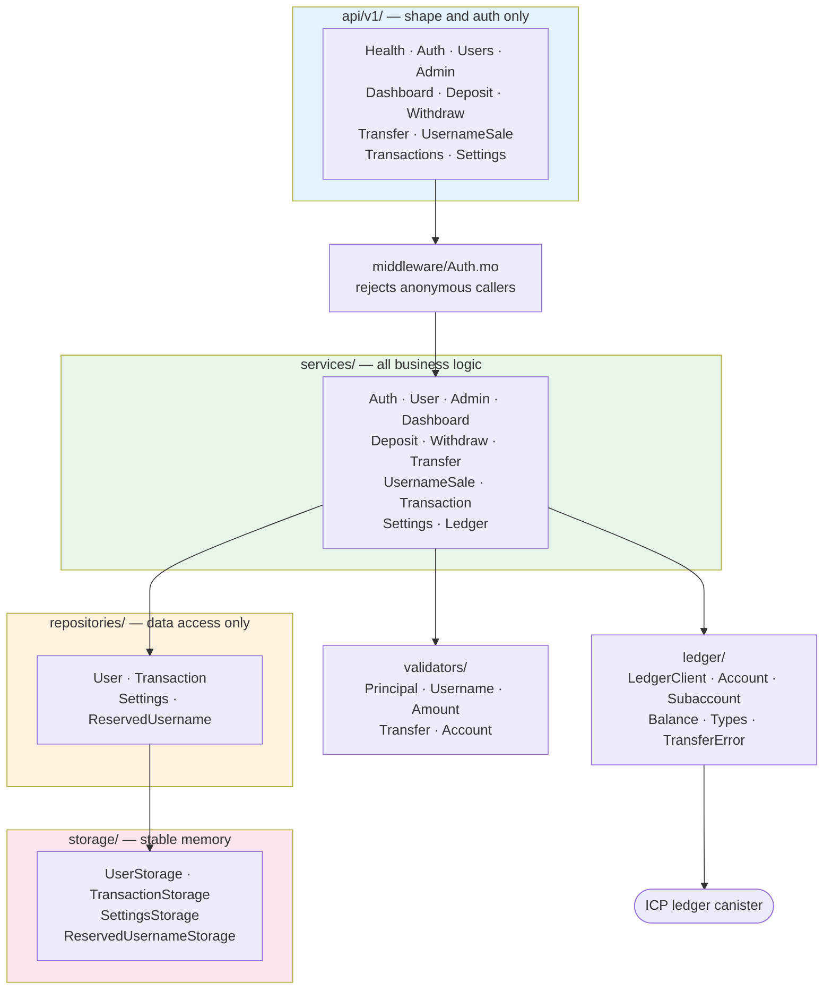
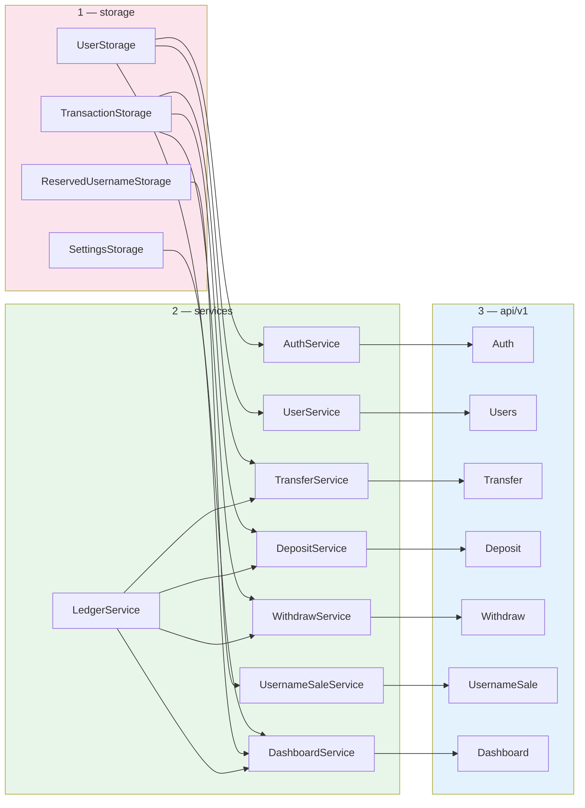
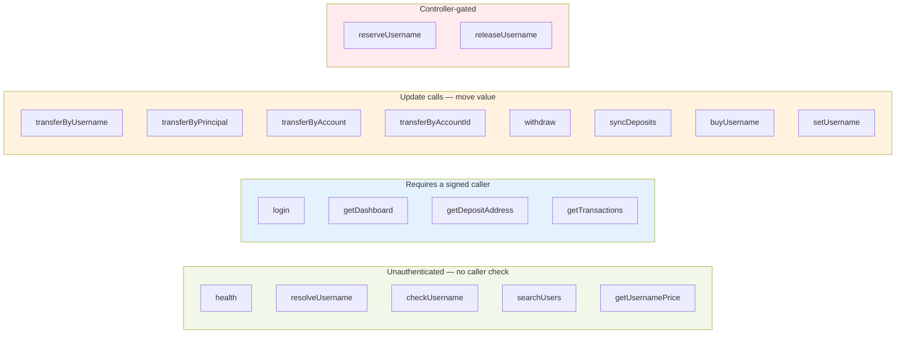
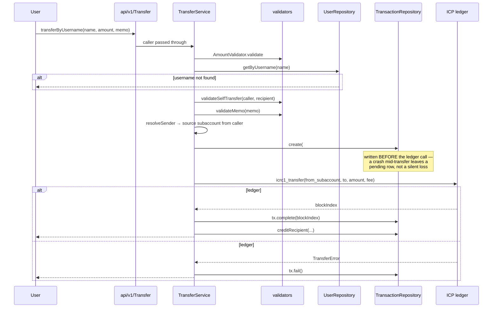
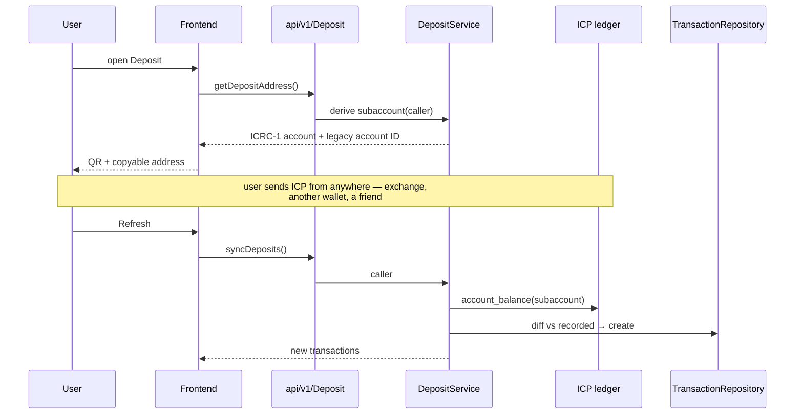
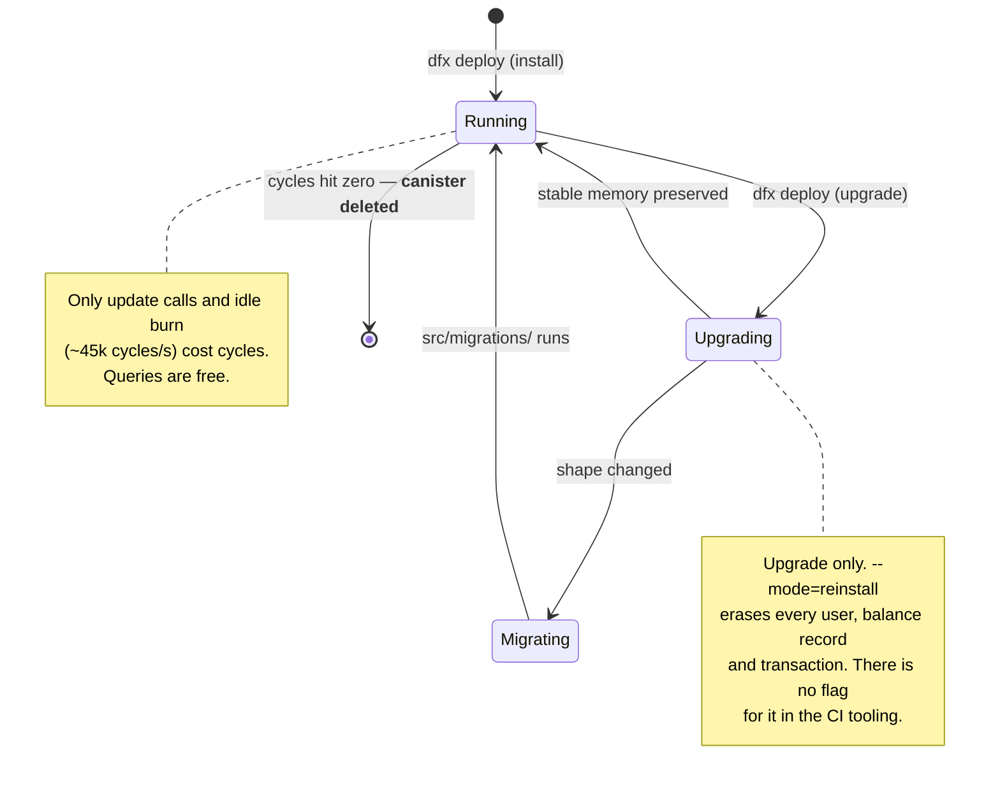

# Backend architecture

Motoko canister. Entry point `src/main.mo`, which wires the API modules to the
services and nothing more.

---

## Layering

`CONTRIBUTING.md` enforces this. No business logic in `api/` or
`repositories/`. Never skip a layer.

**Why the layers are worth the ceremony.** `storage/` is stable memory — it
survives upgrades, so its shape is a migration liability. Keeping logic out of
it means a rule change never forces a data migration.

---

## Module wiring

How `main.mo` assembles the actor at init. Storage is created first because
everything else borrows a handle to it.

---

## Endpoint map

Query vs update matters for cost and for safety. **Queries are not billed on the
IC** — only update calls and idle burn (~45k cycles/s) cost anything. Queries
are also uncertified, so nothing security-critical may depend on one.

**The directory is world-readable on purpose.** `resolveUsername` and
`searchUsers` take no `caller` (`api/v1/Users.mo:18,22`). They have to work for
someone who has not signed in — otherwise you could not look up who to pay
before creating an account.

**Admin cannot touch funds.** `api/v1/Admin.mo` exposes reserve and release for
usernames. That is the entire admin surface.

---

## Transfer sequence

The most important path in the codebase. Note where the transaction record is
written relative to the ledger call.

**Why the record is created first.** If it were written after a successful
ledger call, a trap between the two would move real funds with no record of it.
Writing first means the worst case is a pending row that reconciles against the
ledger — recoverable, and visible.

**`from_subaccount` comes from `caller`.** Not from an argument. This one line
is why an attacker cannot drain another account by crafting a request.

---

## Deposit sequence

Deposits are pulled, not pushed. The canister cannot be notified when someone
sends to a subaccount, so it reconciles on demand.

**Both address formats are returned** because exchanges are split between
ICRC-1 accounts and legacy 64-char account identifiers. Offering only one
strands users on whichever exchange doesn't support it.

---

## State and upgrades

**Cycles are an availability risk, not just a bill.** At zero the canister is
deleted and every user record goes with it. `npm run ci cycles:balance` is the
one number to watch.
