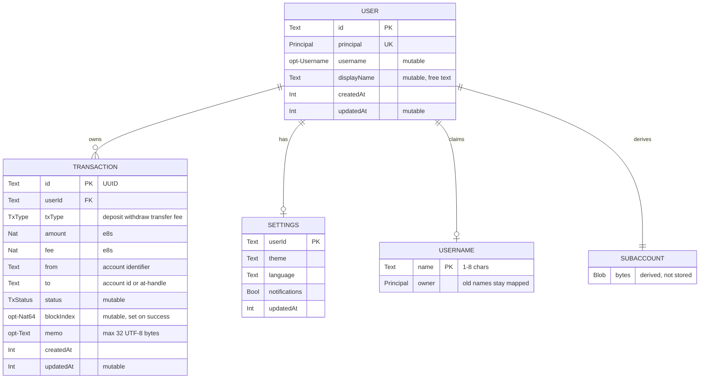
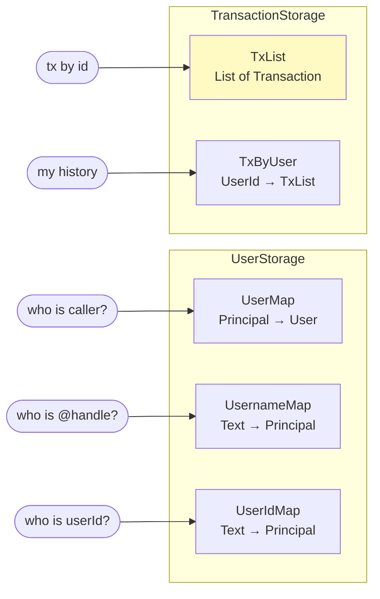
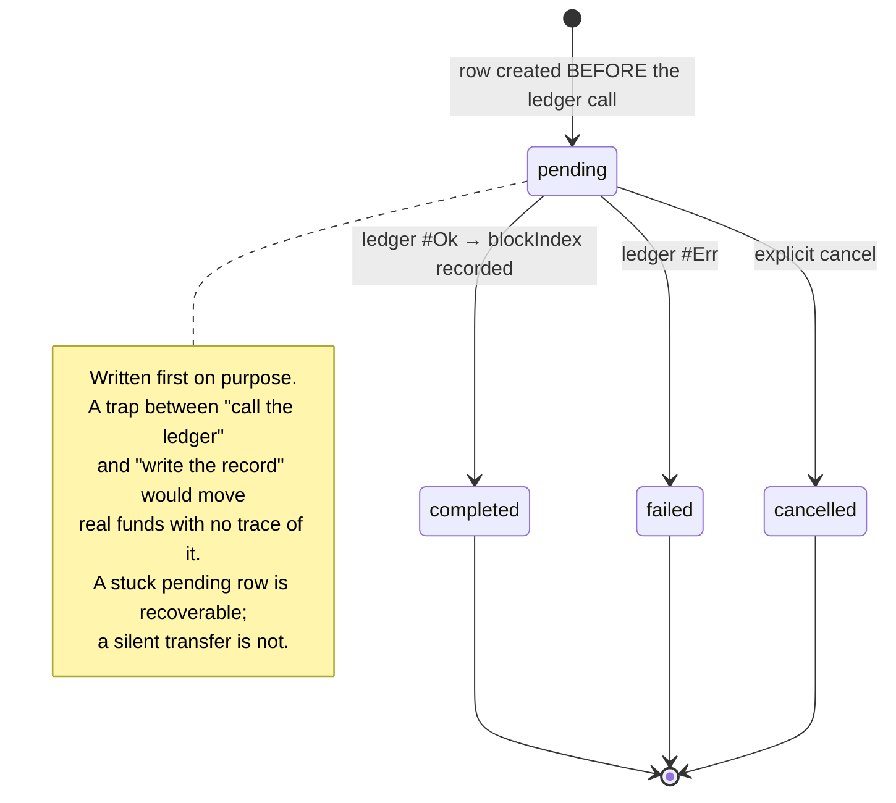
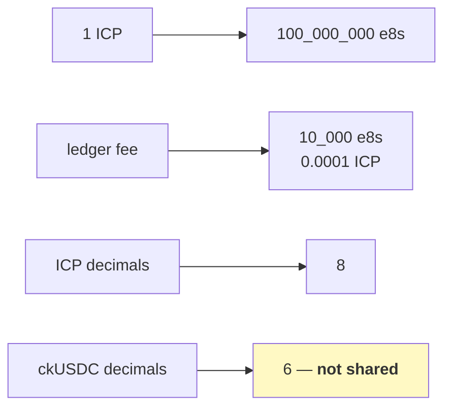
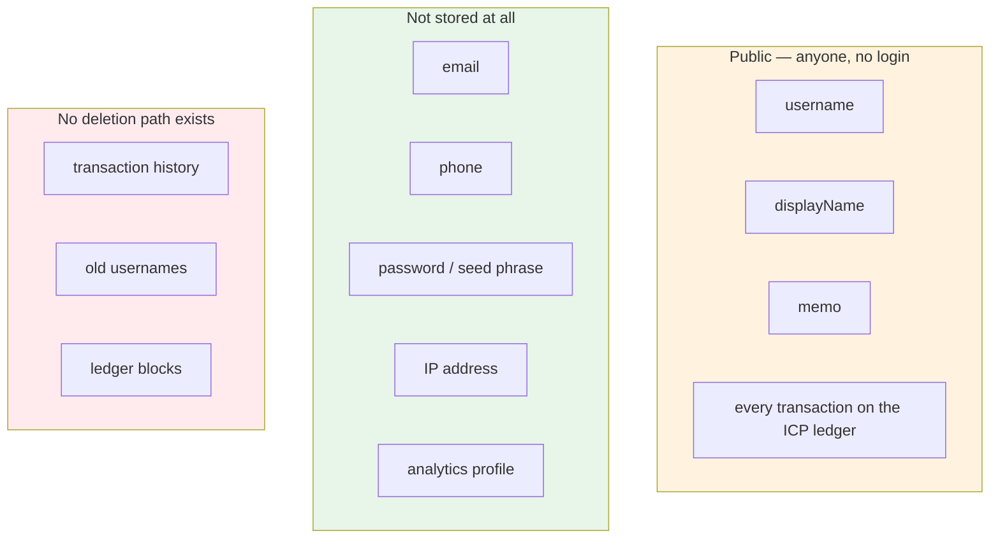
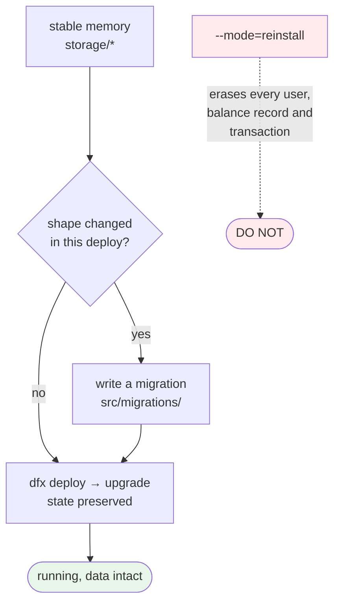

# Data model

What is stored, where, and what that means for a user. Field names and types are
taken from `backend/src/types.mo` and the `storage/` modules.

---

## Entities

**`SUBACCOUNT` is derived, never stored.** It is computed from a length-prefixed
principal every time it is needed (`ledger/Subaccount.mo`). Nothing to migrate,
nothing to corrupt, and the same user always resolves to the same deposit
address.

---

## Storage maps

Three maps for users, because three different lookups have to be fast.

**`UsernameMap` is why old handles keep working.** Changing a username adds a
new entry without removing the old one, so a previously published address
resolves forever (`UserRepository.mo:73-85`).

**`TxList` is a known scaling issue.** `getById`, `completeTx` and `failTx` scan
it linearly. Fine at current volume; quadratic later. An ID-keyed map is on the
roadmap before six-figure volume. `TxByUser` already avoids the scan for the
common per-user history read.

---

## Transaction lifecycle

A `completed` row always carries a `blockIndex`, which is the ledger's own
receipt. That is what makes any transaction independently verifiable against the
ICP ledger — the user does not have to trust ICPay's copy.

---

## Amounts

Everything on-chain is an integer in the token's smallest unit. Floats never
touch a balance. **Decimals are per-token**, which is why Phase 3's multi-token
transfer cannot reuse ICP's formatting.

---

## What is public and permanent

The part that belongs in a privacy policy, stated as a diagram.

**`displayName` and `memo` are free text, permanent, and public.** A user typing
something private into a memo is publishing it. The UI should keep saying so.

**There is no delete endpoint** in any `api/v1/*.mo`. That is not an oversight —
on-chain history cannot be rewritten, so promising erasure would be a lie.

**The directory is queryable by anyone.** `searchUsers` and `resolveUsername`
take no caller.

---

## Upgrade safety

The CI tooling has **no flag for reinstall**. `npm run ci backend:deploy` is
upgrade-only, and every mainnet write sits behind an interactive confirm that
refuses to run without a TTY.

Rollback is verifiable: a canister's module hash is exactly the sha256 of its
wasm, so `backend:rollback <ref> <hash>` rebuilds that commit in a throwaway
worktree and refuses to install on a mismatch. The IC keeps no archive of past
wasms — a hash is a fingerprint, not an artifact.
