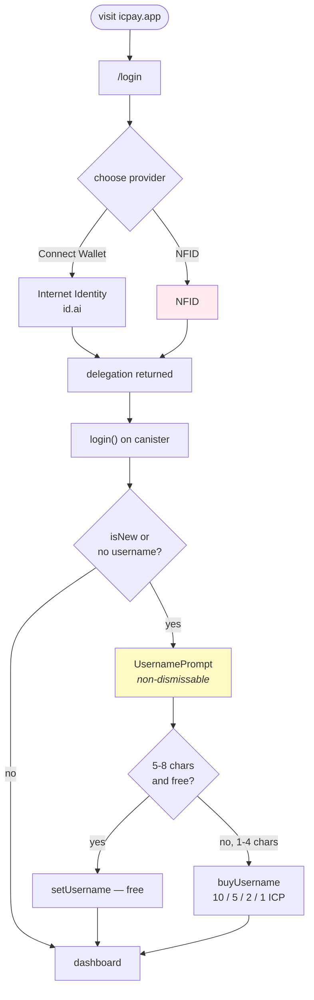
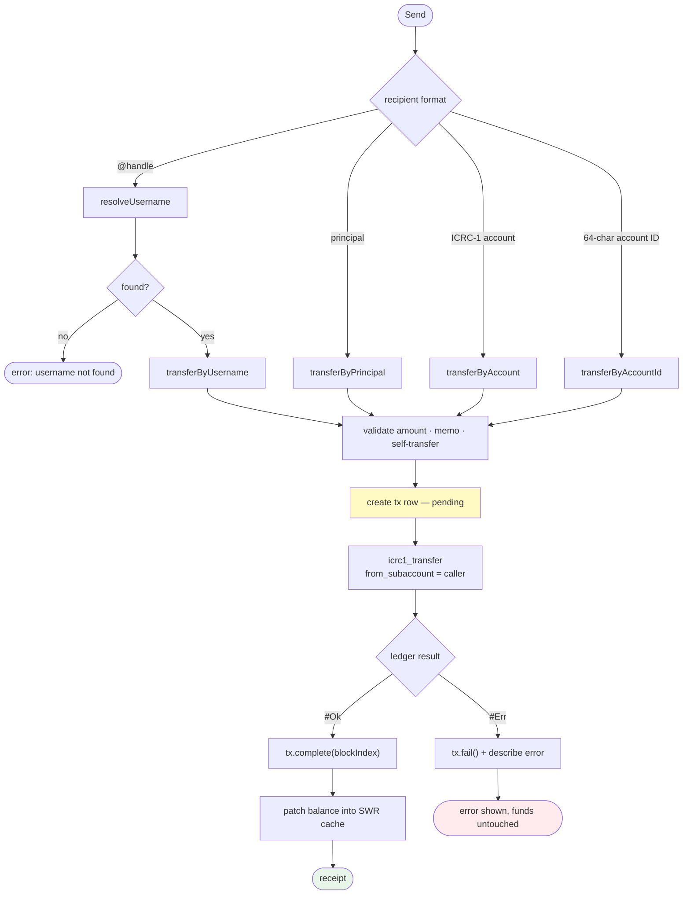
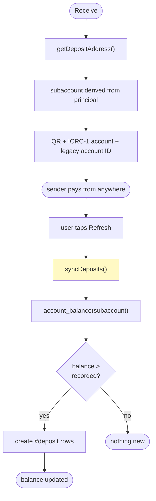
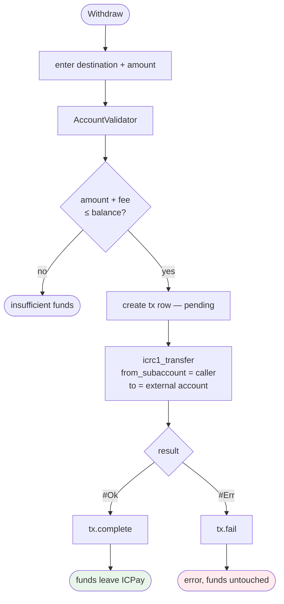
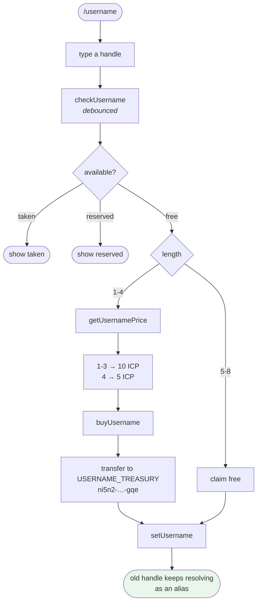
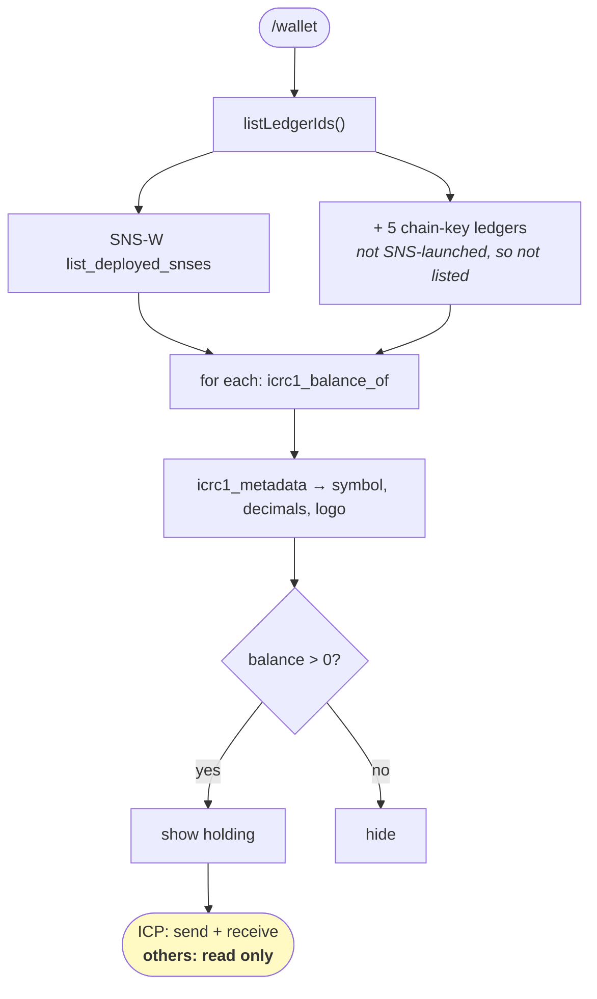
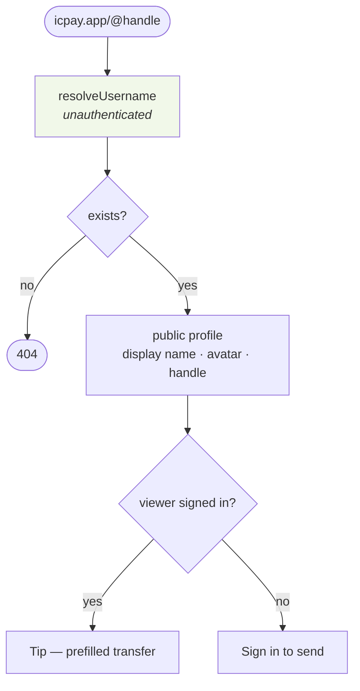

# User flows

End to end, from tap to settled. Every branch shown here exists in the code.

---

## Onboarding

**NFID derives a different principal** — it is a separate identity system, so it
is a *different wallet*. An existing II user who signs in with NFID sees an empty
balance and assumes their funds are gone. The login page says so in one line
directly under the button; that line is not decoration.

**The username prompt has no escape.** No close button, no outside click, no
escape key. A user without a handle cannot be paid by handle, which is the
entire product.

---

## Send

Four address formats because people paste whatever their other wallet gave
them. The memo is capped at **32 UTF-8 bytes** — counted in bytes, not
characters, because one emoji costs four and the ledger rejects an oversized
blob outright.

---

## Receive

**Deposits are pulled, not pushed.** The ICP ledger does not call back into a
canister when funds land in a subaccount, so there is no event to subscribe to.
The canister reconciles its recorded total against the real balance when asked.
That is why deposits need a Refresh and are not instant.

---

## Withdraw

The 10_000 e8s ledger fee goes to **the ledger, not to ICPay**. ICPay takes no
cut of a transfer or a withdraw. The only revenue today is short-username sales.

---

## Buy a username

**Two pricing rules coexist and both are real.** 5–8 characters are free to
*claim*; any length can be *bought*. That is why the UI can show a 5-character
handle at 2.0 ICP and still be correct — buying it is a separate path from
claiming it.

**Old handles never break.** Changing a username keeps the previous one
resolving (`UserRepository.mo:73-85`), so an address published on a business
card or in a post keeps working forever.

**Proceeds go to a plain principal**, not a canister subaccount, so the treasury
owner can spend them without routing through this canister.

---

## Multi-token view

**Read only, today.** `LedgerClient.mo` is bound to the ICP ledger canister ID,
so non-ICP tokens can be seen but not moved. Generalizing it is Phase 3 of the
roadmap — and it is the prerequisite for token creation, trading and merchant
payments alike.

---

## Public profile

The lookup is deliberately unauthenticated. Requiring a login to *see* a profile
would make an ICPay link useless in a bio or a post — which is the point of
having a username instead of a 63-character principal.
