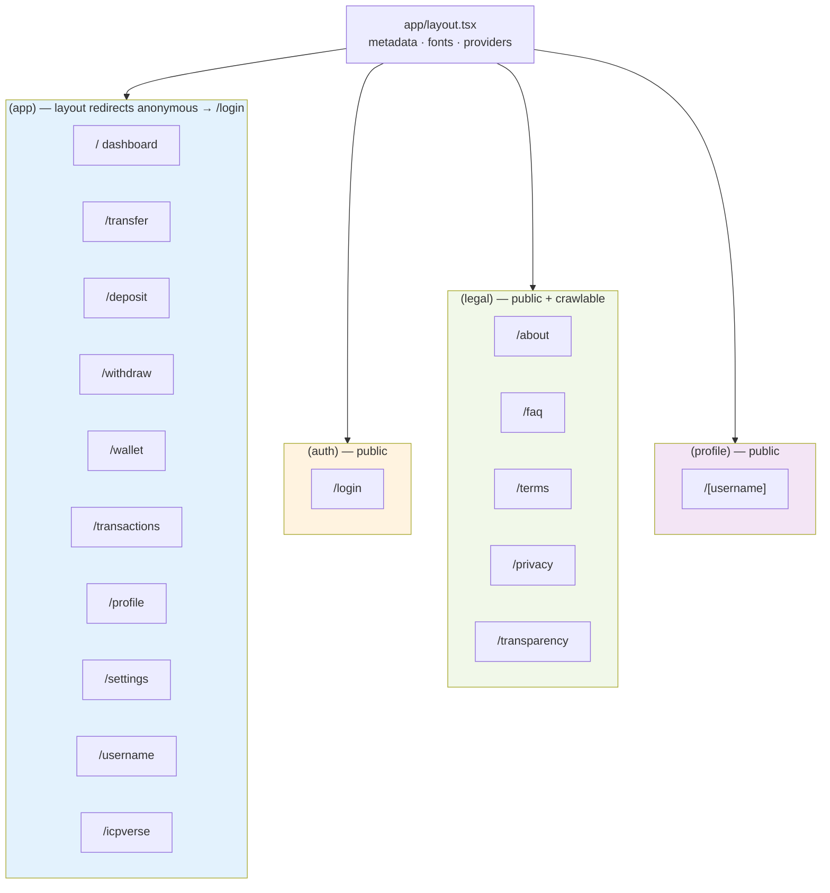
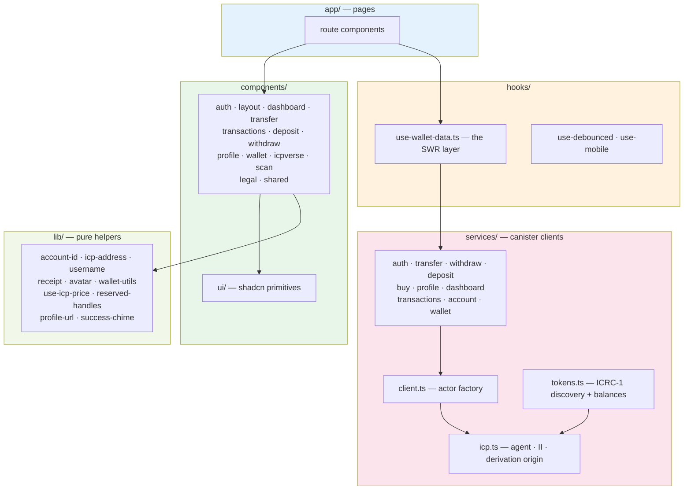
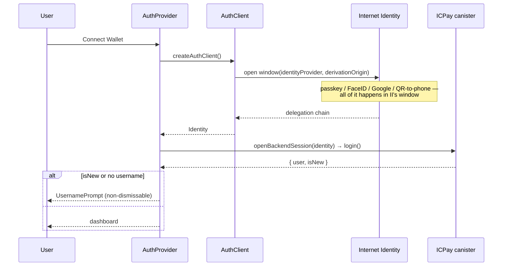
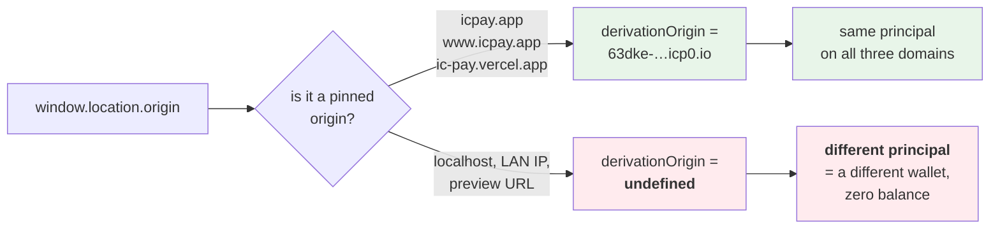
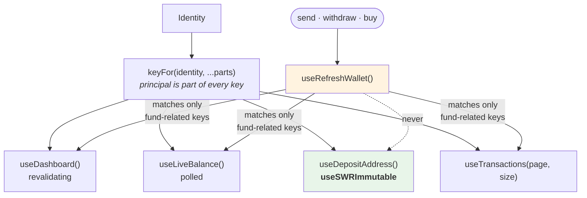
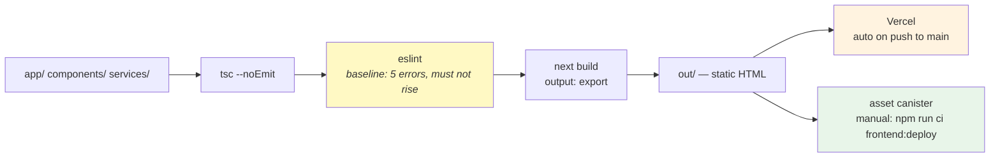

# Frontend architecture

Next.js 16.2.6, React 19, App Router, `output: "export"` — a fully static build.
No server, no API routes, no server actions. Every dynamic thing happens in the
browser against the canister.

---

## Route groups

The group decides the auth policy. That is the whole reason they exist.



**Why legal pages sit outside `(app)`.** The `(app)` layout redirects anonymous
visitors, which would make Terms and Privacy invisible to a crawler — and
unreadable by someone deciding whether to sign up. `(legal)` has no guard, so
those pages prerender to real static HTML.

`/login` is the only crawlable entry point into the app, so it carries the
inbound links to `/about`, `/faq` and `/transparency`.

---

## Layers



`lib/` is pure — no network, no React. That is what makes it testable without a
canister.

---

## Auth flow

The part people get wrong: **the dApp never runs the WebAuthn ceremony.**
Internet Identity does, in its own window. A credential minted from this origin
would be unrelated to the user's principal and could not sign a single canister
call.





**This trips everyone at least once.** Signing in from `localhost` or a LAN IP
gives a *different principal*, so the wallet looks empty. Nothing is lost — it
is simply a different account. localhost can never be added to the alternative
origins list because II requires HTTPS.

`public/.well-known/ii-alternative-origins` and `ALTERNATIVE_ORIGINS` in
`services/icp.ts` must stay byte-identical. If they drift, one domain silently
breaks.

---

## Data fetching

SWR. `hooks/use-wallet-data.ts` is the only place that talks to it.



**The identity is baked into every cache key** so that signing out and back in
as someone else cannot show the previous user's balance from cache.

**Deposit address is `useSWRImmutable`** because it is derived
deterministically from the principal — it cannot change, so revalidating it is
pure waste.

**`useRefreshWallet` matches selectively.** Invalidating every key for the
principal would also drop the immutable deposit address and re-fetch static
data on every send.

---

## Build and deploy



`next lint` was removed in Next 16. Verify from `frontend/`:

```bash
./node_modules/.bin/tsc --noEmit
./node_modules/.bin/eslint services hooks components app lib --ext .ts,.tsx
```

The lint baseline is exactly **5** `react-hooks/set-state-in-effect` errors. It
must not rise.

Environment values are baked in **at build time** by a static export. Changing
`NEXT_PUBLIC_SITE_URL` in Vercel does nothing until a rebuild.
