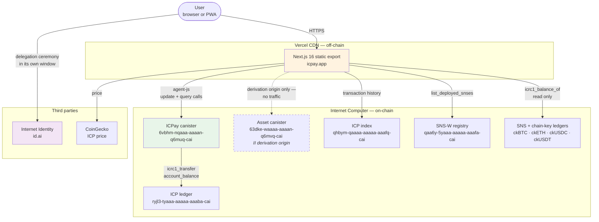
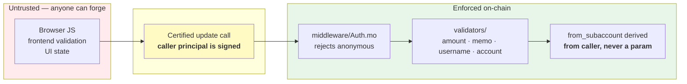
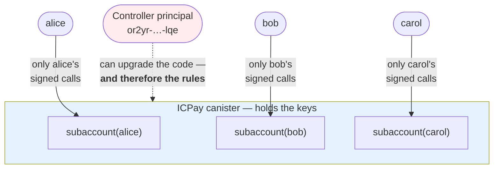
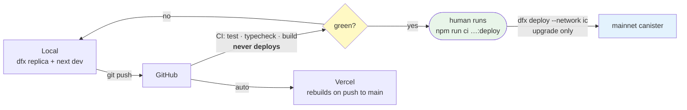

# System overview

Where ICPay runs and what it talks to. Everything here was read off the code and
the live deployment, not assumed.

---

## Context

The single most misread fact about this project: **the backend is on-chain, the
frontend is not.** The UI is a static export served by Vercel. Only
`6vbhm-nqaaa-aaaan-q6muq-cai` lives on the Internet Computer.

**Why the asset canister exists at all.** It never serves traffic. Its only job
is to be the Internet Identity *derivation origin*, pinned permanently to
`https://63dke-waaaa-aaaan-q6mvq-cai.icp0.io`. II derives a user's principal
from that origin, so all three domains — `icpay.app`, `www.icpay.app`,
`ic-pay.vercel.app` — resolve to the same wallet. Change it and every user gets
a different principal and cannot reach their funds.

---

## Trust boundaries

Who can do what. The dashed line is the one that matters.

The load-bearing property: **every withdraw and transfer derives
`from_subaccount` from `caller`.** It is never accepted as an argument. There is
no code path by which one user's call moves another user's funds, and
`api/v1/Admin.mo` exposes only username reserve/release — it cannot touch a
balance at all.

Frontend validation is a convenience. It is re-run on-chain because a browser
can be edited.

---

## Custody model

A subaccount is derived deterministically from a length-prefixed principal
(`ledger/Subaccount.mo`), so the same user always gets the same deposit address.

**The honest caveat, stated plainly:** custodial means the canister holds the
keys. Funds are safe from other *users*, not from a canister *upgrade*. One
controller principal can replace the code and therefore the rules. Moving that
controller to an SNS or NNS-controlled canister is Phase 6 of the roadmap.

---

## Environments

**CI never deploys.** Auto-deploying would require putting the canister's
controller key in a GitHub secret — a key that can also *delete* the canister,
taking every user record with it. Shipping stays a local command run by a human,
behind an interactive confirm that refuses to run without a TTY.
