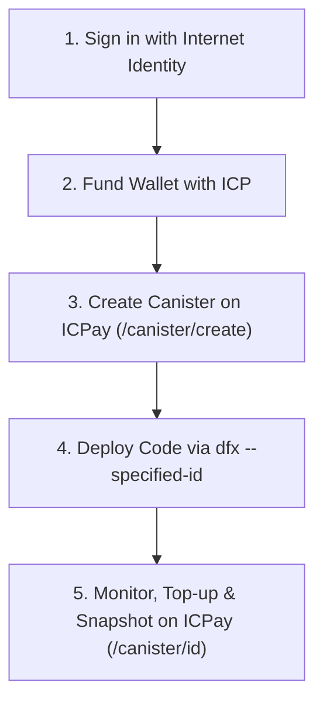

# ICPay Canister Management — User Workflow & Architecture

See full documentation and architecture diagrams in [mermaid.md](file:///home/prasanga/Desktop/icppay/docs/canister/users/workflow/mermaid.md).

