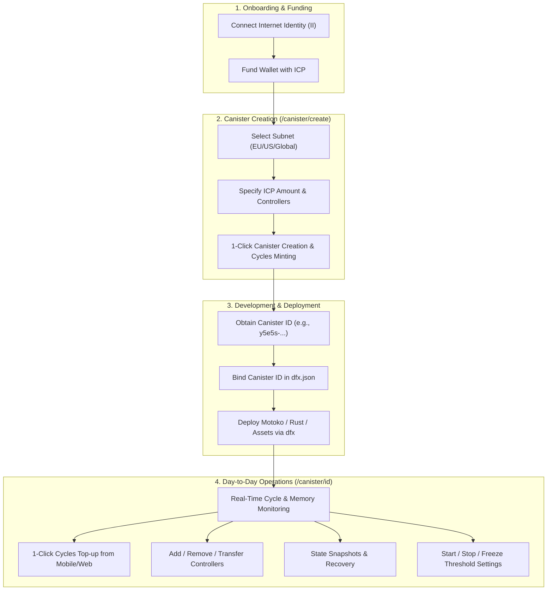
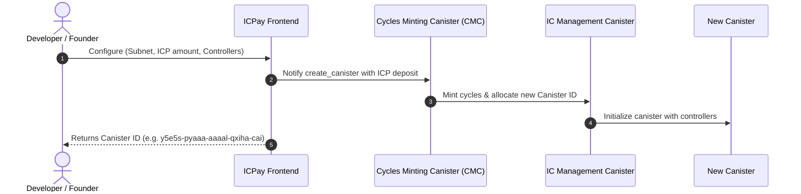
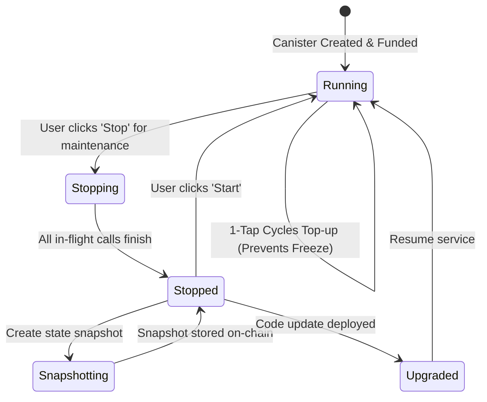
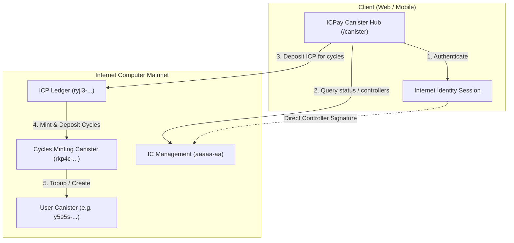

# ICPay Canister Management — User Workflow & Architecture

This document details the end-to-end user journey, lifecycle workflows, and architectural flow for creating, managing, and maintaining Internet Computer canisters on ICPay.

---

## 1. High-Level User Journey

The workflow bridges non-technical founders, mobile-first operators, and command-line developers into a unified on-chain interface.



---

## 2. Detailed Workflow Phases

### Phase 1: Authentication & Wallet Preparation
- **Action**: User visits `icpay.app` and signs in via Internet Identity.
- **Why**: No private keys or seed phrases to manage; authentication uses hardware-backed WebAuthn (Passkeys / FaceID / TouchID).
- **Funding**: User deposits ICP to their ICPay subaccount or receives ICP via handle (`@username`).

### Phase 2: On-Chain Canister Provisioning (`/canister/create`)
Users no longer need to use `dfx ledger` or manually manage cycles ledgers.



**Key Advantages:**
1. **Zero CLI hurdles**: Create canisters directly from a smartphone or tablet.
2. **Subnet customization**: Target specific European GDPR subnets, high-memory subnets, or standard subnets.
3. **Multi-controller setup**: Automatically sets both the developer's CLI principal (`dfx identity get-principal`) and Internet Identity principal.

---

### Phase 3: Project Integration & Code Deployment
Once provisioned, developers link the canister to their local repository.

1. **Configure `dfx.json`**:
   ```json
   {
     "canisters": {
       "backend": {
         "type": "motoko",
         "main": "src/main.mo"
       }
     }
   }
   ```
2. **Deploy Code directly to the provisioned canister**:
   ```bash
   dfx deploy --network ic --specified-id <YOUR_CANISTER_ID>
   ```

---

### Phase 4: Production Telemetry & Lifecycle Management (`/canister/[id]`)



#### Key Capabilities on `/canister/[id]`:
- **Cycles Guard**: Visual telemetry on cycles balance and remaining runway. One-click instant conversion of ICP to cycles without leaving the page.
- **Access Control Hub**:
  - Add developer teammates, CI/CD principals, or automated orchestrators as controllers.
  - Safe handover of primary ownership with confirmation safeguards.
- **State Snapshots**:
  - Create full on-chain snapshots before executing migrations or upgrades.
  - Restore previous state instantly if a migration encounters anomalies.
- **Resource Constraints**:
  - Adjust freezing threshold (in seconds).
  - Configure memory allocation (0–400 GiB on 64-bit storage).
  - Configure compute allocation.

---

## 3. Architecture & Security Model



- **Non-Custodial Control**: Canister management calls are executed directly against the IC Management Canister (`aaaaa-aa`) using the user's authenticated principal.
- **Transparent Execution**: No third-party servers intermediary; all canister status queries and update calls route directly to the Internet Computer consensus.
