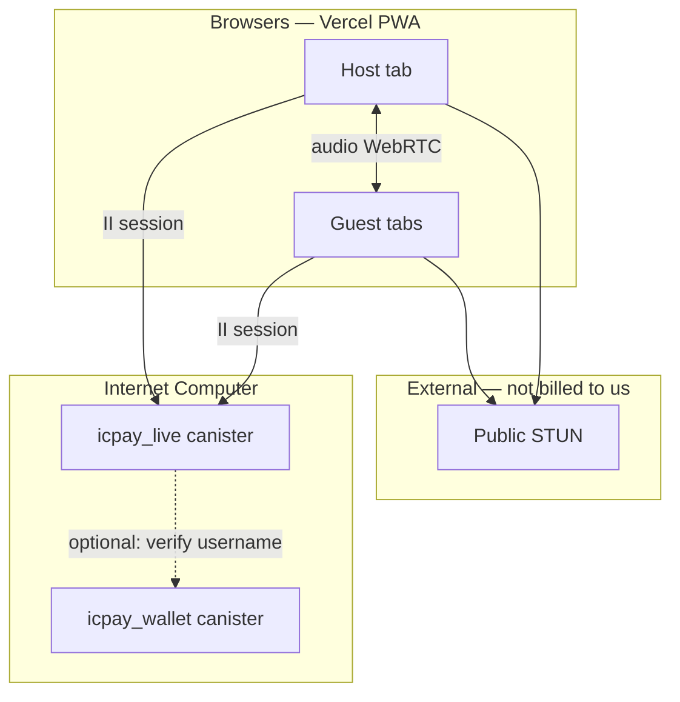

# ICPay Live — audio rooms plan

Minimal live audio for ICPay: create a room, go live, pause, resume, end.
**Audio never touches the chain.** The canister only stores room metadata and
WebRTC signaling. Media is browser-to-browser.

Plan only — no code yet. Fits after Phase 5 (swap) unless explicitly prioritized.

---

## Summary

| | |
|---|---|
| What | Voice rooms tied to II identity and optional `@username` share links |
| Media path | WebRTC P2P (audio-only). Zero canister cycles for audio bytes |
| On-chain | Room registry, host controls, membership, small SDP/ICE signaling |
| Off-chain | STUN (free public servers). Optional TURN later for strict NAT |
| Cycle model | Queries for reads (free). Bounded update calls for writes only |
| Canister | **Separate** `icpay_live` canister — isolates signaling load from wallet |

**User flow**

1. Host opens **Live → New room**, enters title, picks **Public** or **Private**.
2. Host taps **Start** → mic on, room state = `live`.
3. Listeners open the link (public list or invite token for private).
4. Host can **Stop** (pause, room stays open) or **Resume**.
5. Host **End** archives the room; signaling mailboxes are cleared.

---

## Why not stream audio on-chain

Putting audio through a canister would burn cycles per second per listener and
hit ingress/message size limits. That is the wrong layer.

The IC pattern that works (used by ic-video, ChainConnect, Exeud, and recent
forum signaling work):

```
Browser A  ←—— WebRTC audio ——→  Browser B
     ↓                              ↓
     └———— small signaling only ————┘
                    ↓
            icpay_live canister
            (room state + SDP/ICE relay)
```

Signaling messages are a few KB each, sent only while peers connect or reconnect.
Once WebRTC is up, the canister is almost idle until someone joins or leaves.

---

## Architecture



### Layer split

| Layer | Responsibility | Cycles |
|---|---|---|
| **Frontend** (`/live/*`) | UI, `getUserMedia({ audio: true })`, WebRTC, poll signals | None on IC |
| **Live API** (`api/v1/Live.mo`) | Auth caller, validate, delegate | Per update only |
| **LiveService** | Room lifecycle, host ACL, rate limits | Business logic |
| **LiveRepository** | Stable room index + transient mailboxes | Data access |
| **LiveStorage** | Upgrade-safe maps, TTL cleanup | Stable + transient |

Wallet canister is **not** in the hot path. Live canister reads usernames via
optional query to wallet only when rendering a public room card (`@host` label).

---

## Room model

### States

```
draft → live ⇄ paused → ended
```

| State | Meaning |
|---|---|
| `draft` | Created, host has not started |
| `live` | Host started; joins allowed per visibility rules |
| `paused` | Host stopped; peers disconnect media, room stays joinable |
| `ended` | Terminal; mailboxes cleared, read-only metadata kept briefly |

Only the **host principal** may `start`, `stop` (pause), `resume`, or `end`.

### Visibility

| Mode | Discovery | Join |
|---|---|---|
| **Public** | Listed in `listPublicRooms` (query) | Any signed-in user |
| **Private** | Hidden from list | Invite token in URL **or** host approval queue |

Private invite: host gets `https://icpay.app/live/{roomId}?t={token}`. Token is
a hash stored at create time; never the raw secret on-chain.

### Session type (v1)

Start with **conference** only: every participant may speak (mesh WebRTC).

| Type | v1 | Later |
|---|---|---|
| Conference (≤6 speakers) | ✅ | — |
| Broadcast (host-only audio) | — | ✅ fewer connections |
| Stage + listeners | — | ✅ SFU-style or mesh cap |

Cap speakers at **6** in v1 to keep mesh complexity bounded in the browser.

---

## Data kept on-chain (minimal)

### Stable (survives upgrade)

```motoko
type Room = {
  id : Text;                    // short id, e.g. "a3k9m2"
  title : Text;                 // max 80 chars
  host : Principal;
  visibility : { #public; #private };
  inviteHash : ?Blob;           // only for #private
  state : { #draft; #live; #paused; #ended };
  createdAt : Nat64;
  endedAt : ?Nat64;
};
```

No audio blobs. No chat log in v1.

### Transient (lost on upgrade — acceptable)

```motoko
type Peer = {
  tabId : Text;                 // client-generated per tab
  principal : Principal;
  joinedAt : Nat64;
};

type SignalMsg = {
  id : Nat;
  fromTab : Text;
  toTab : ?Text;                // null = broadcast within room
  payload : Text;               // SDP or ICE JSON, max 4_096 bytes
};
```

Per-room **bounded mailbox**: max 64 messages, FIFO drop. Prevents cycle attacks.

---

## API (v1)

All **reads are queries**. All **writes are updates** with rate limits.

| Method | Type | Purpose |
|---|---|---|
| `createRoom(title, visibility, inviteSecret?)` | update | Returns `roomId` |
| `startRoom(roomId)` | update | `draft|paused` → `live` |
| `pauseRoom(roomId)` | update | `live` → `paused` |
| `resumeRoom(roomId)` | update | `paused` → `live` |
| `endRoom(roomId)` | update | → `ended`, clear mailboxes |
| `joinRoom(roomId, tabId, inviteToken?)` | update | Register peer |
| `leaveRoom(roomId, tabId)` | update | Unregister |
| `postSignal(roomId, tabId, toTab, payload)` | update | Enqueue signaling |
| `pollSignals(roomId, tabId, afterId)` | **query** | Fetch new signals |
| `getRoom(roomId)` | **query** | Metadata + peer count |
| `listPublicRooms(limit, cursor)` | **query** | Live public rooms only |

Frontend signaling loop: `pollSignals` every 500–1000 ms while connecting, then
back off to 2 s on idle. **Polling via query = no cycle cost.**

---

## Frontend screens

| Route | Screen |
|---|---|
| `/live` | Public live rooms + **New room** |
| `/live/new` | Title, Public/Private toggle, Create |
| `/live/[id]` | Room: title, host, participants, mic mute, host controls |

### Room UI (minimal)

**Everyone:** mic on/off, leave, connection indicator.

**Host only:** Start | Stop | Resume | End.

No video, no chat, no reactions in v1 — keeps bundle and UX clean.

### WebRTC profile

```ts
const stream = await navigator.mediaDevices.getUserMedia({
  audio: { echoCancellation: true, noiseSuppression: true },
  video: false,
})
```

ICE servers (v1): public Google STUN only. Document that some corporate NATs
may fail until TURN is added.

---

## Cycle and load budget

Design goal: **live traffic must not threaten wallet canister cycles.**

| Action | Billing | Estimate |
|---|---|---|
| List / poll signals | Query | **~0** (not billed) |
| Create / join / signal post | Update | ~0.05–0.2M cycles each |
| Idle live canister | Idle burn | ~1.4T/year (separate canister) |

Rough worst case: 100 rooms × 6 peers × 20 signal posts while connecting ≈ 12k
updates. At ~100k cycles each ≈ 1.2B cycles (~$0.0016) — negligible if bounded.

**Guards**

- Rate limit: 30 `postSignal` / minute / tab
- Max payload 4 KB; reject larger
- Auto-`end` rooms idle > 24 h in `paused` or `draft`
- Transient mailboxes cleared on `end` or peer TTL (no heartbeat updates)

---

## Security

- **Caller = identity.** Host checks compare `msg.caller` to `room.host`.
- **Private rooms:** constant-time compare on `hash(inviteToken)`.
- **No anonymous host.** II required to create (matches ICPay auth model).
- **Signaling is not secret media** — treat as coordination only; optional DTLS
  SRTP is handled by WebRTC. E2EE for signaling is a later enhancement.
- **Abuse:** rate limits + max rooms per principal (e.g. 3 live at once).

---

## Deployment shape

```
icppay/
├── backend/              # wallet — unchanged
├── live/                 # NEW: icpay_live canister (Motoko)
│   ├── src/main.mo
│   ├── src/services/LiveService.mo
│   └── testing/
└── frontend/
    └── app/(app)/live/   # static export pages
```

Separate canister id in `canister_ids.json`. Deploy with same CI pattern as
backend (`npm run ci live:deploy` when wired).

Frontend talks to live canister via `@dfinity/agent` — same II identity, different
canister id env `NEXT_PUBLIC_LIVE_CANISTER_ID`.

---

## Phased delivery

### Phase A — MVP (1–2 weeks)

- Separate `icpay_live` canister with table above
- Conference mode, 6-speaker cap, public + private
- PWA pages: list, create, room
- Mesh WebRTC audio, STUN only
- Tests: room lifecycle, host ACL, mailbox bounds

### Phase B — Polish

- `@username` on room cards (wallet query)
- Share sheet / copy link
- Reconnect on tab background
- i18n (10 locales)

### Phase C — Scale (if needed)

- Broadcast mode (one-way, many listeners)
- TURN relay (self-hosted or paid) for NAT
- Optional: tip host via existing transfer flow (deep link to `/transfer`)

---

## What we are not building

| Skip | Why |
|---|---|
| Audio on-chain | Cycle burn, size limits |
| Server-side mixing | Needs Web2 SFU; defeats minimal IC scope |
| Recording to canister | Storage cost; use client MediaRecorder → ICPay Cloud bucket later if wanted |
| Native apps | Roadmap: PWA covers mobile |
| Video | Scope creep; audio-first keeps bandwidth low |

---

## Open decisions

1. **Monetization:** free for all v1, or gate >30 min / >6 peers behind premium?
   Recommendation: free v1, measure cycles first.
2. **Moderation:** report + admin `endRoom` for public abuse?
   Recommendation: host-only end in v1; admin hook in Phase B.
3. **Wallet coupling:** live canister fully standalone vs shared username index?
   Recommendation: standalone; optional query to wallet for display names.

---

## Success metrics

- Median time create → first audio: **< 15 s**
- Canister cost at 50 concurrent rooms: **< $1/month** incremental
- Zero wallet canister cycle impact from live traffic
- Host can pause and resume without recreating room or link

---

## References

- [WebRTC signaling on the IC (forum)](https://forum.dfinity.org/t/webrtc-signaling-on-the-ic/69796)
- [ic-video](https://github.com/rashansmith/ic-video) — P2P video, IC signaling
- ICPay costing: `docs/costing/here.md` — queries are not billed
- ICPay roadmap: Phase 5 swap first; live is a **parallel social layer**, not custody
