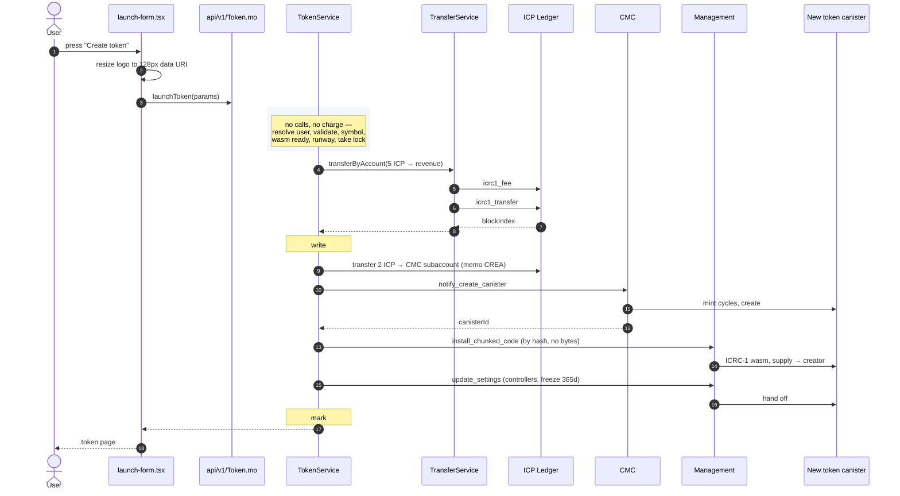

# Phase 4 — the create-token flow, verified

Companion to [`here.md`](here.md) (decisions), [`code.md`](code.md)
(implementation) and [`mermaid.md`](mermaid.md) (load).

This file answers one question: **from the instant the user presses "Create
token", what actually runs, in what order, and what is true when it says
success?**

Every step below names the real function it calls and the file it already lives
in. Where a step calls something Phase 4 must add, it says so. Nothing here is
paraphrase — the signatures were read out of `backend/src/`, and the three places
where the plan disagreed with the code are listed under
[Findings](#findings-from-this-pass).

---

## The flow in one screen



---

## Step by step

### Phase A — free. No charge, no calls.

Everything here is local computation. A user who fails any of it pays nothing and
consumes nothing but our own execution.

| # | What runs | Where it lives | Fails with |
|---|---|---|---|
| 1 | Resolve caller → `userId` | `UserRepo.getByPrincipal` — `UserRepository.mo:12` | `#err("User not found")` |
| 2 | Field validation | `TokenValidator.validate` — *new* | `?Text` from the first failing rule |
| 3 | Symbol normalise + reserved check | `Text.toUpper`, `Set.contains(reservedSymbols)` | `#err("Symbol PHON is reserved")` |
| 4 | Wasm sealed? | `TokenWasmService.isReady` — *new* | `#err("Token creation is temporarily unavailable")` |
| 5 | Runway above reserve? | `Cycles.balance() < MIN_CYCLE_RESERVE` | same string as 4 — deliberately indistinguishable |
| 6 | Take the symbol lock | `Set.add(service.pending, symbol)` | `#err("A launch for this symbol is already in progress")` |

Step 1 resolves in the **service**, not the mixin. That matches
`TransferService.resolveSender` (`TransferService.mo:105`) and holds the layering
rule: no `api/v1` file touches a repository.

Steps 4 and 5 return the same string on purpose. "Our cycle balance is low" is
operational information a caller has no business learning.

Step 6 is a `transient` set. An upgrade landing between two calls must not strand
a symbol behind a lock nobody will ever release.

### Phase B — the charge. Two ledger calls.

**Step 7 — debit the user.**

```motoko
TransferService.transferByAccount(
  service.transfers, caller, Config.ICP_LEDGER_CANISTER_ID,
  AccountHelper.revenueAccount(service.self), Config.LAUNCH_FEE, ?launchMemo(symbol))
```

Real signature, `TransferService.mo:80`. Inside it:

1. `validateRequest` — allowlist + `AmountValidator.validate`. The allowlist is a
   security boundary, not a convenience check (`TransferService.mo:87`): an
   unvalidated id reaching `actor(id)` lets a caller point the custodian at a
   canister they wrote, which can return a forged `#Ok`.
2. `TransferValidator.validateMemo` — `launch:PHON` is 11 bytes against
   `MEMO_MAX_BYTES = 32`. Fits.
3. `resolveSender` — resolves the user again and derives their custodial
   subaccount. Deliberately does **not** read the balance; the ledger reports it
   back in `#InsufficientFunds` and a pre-flight read costs a whole consensus
   round to compute an answer the transfer already gives (`TransferService.mo:99`).
4. `LedgerService.getFee` — **one update-priced call.** A `query` method invoked
   from inside a canister still runs replicated.
5. `TxRepo.create` — the `#transfer` row exists *before* the ledger call, so a
   trap leaves a record.
6. `LedgerService.transfer` with `fee = null`. Null means "charge whatever you
   charge" — sending a number makes every ledger whose fee differs fail `#BadFee`
   (`TransferService.mo:219`).
7. On `#Ok` or `#Err(#Duplicate)`, `tx.complete(blockIdx)` then `creditRecipient`.

**`creditRecipient` writes nothing here, and that is correct.** It only credits
when the destination is a *user's* custodial subaccount
(`recipientOf`, `TransferService.mo:287` — it matches `Subaccount.fromPrincipal(p)`
against the map of user principals). The revenue subaccount is a fixed constant
blob, matches no user, and so produces no phantom `#deposit` row. Verified, not
assumed.

**Step 8 — write the `#pending` row.** Before any canister work, carrying
`paymentBlockIndex`. This is the single thing that makes a failed launch
refundable.

### Phase C — the four calls that build the token.

**Step 9 — buy the canister.** Legacy `transfer` to the CMC's per-target account,
then `notify_create_canister`.

The destination is `Principal.toLedgerAccount(cmc, ?Subaccount.fromPrincipal(self))`.
`Subaccount.fromPrincipal` (`Subaccount.mo:10`) is length-prefixed and
right-aligned in 32 bytes — the prefix makes the encoding injective. This is the
**highest-risk line in Phase 4** and the only thing still unverified; see
[`code.md`](code.md#resolving-it-without-guessing) for the pure-function check
that settles it without spending anything.

`from_subaccount = ?REVENUE_SUBACCOUNT` — the 2 ICP leaves the money the user just
paid, never the canister's own balance. That separation is the whole point of
routing through the CMC.

**Step 10 — install.** `install_chunked_code` with `store_canister = ?self`. The
wasm bytes were uploaded once by a controller at setup; a launch references them
by hash and re-sends nothing. This is what holds a launch at four calls
regardless of wasm size.

`arg` carries the ICRC-1 init record — the whole supply lands in the creator's
`initial_balances`, and `metadata` repeats the logo and socials on the child
ledger so wallets that never heard of ICPay can still render the token.

**Step 11 — hand off.** `update_settings` sets `controllers` to `[creator]`, or
`[]` if the user chose immutable, and `freezing_threshold` to 365 days. After this
call ICPay is not a controller of the token and can never touch it again.

### Phase D — commit.

`markActive` stamps the canister id and module hash, `tokensByUser` gains the
entry, the lock releases, `#ok(token)` returns.

**Nothing is incremented.** `getPlatformStats` derives every number from the maps
this step just wrote (`AnalyticsService.platform`), so the count is correct the
instant the row lands and cannot drift.

---

## Worked example

**@sita launches Phonism / PHON.** Canister id below is illustrative — the CMC
picks it. Rate is the ops skill's worked figure, 1 ICP = 1.5278 T
(`skills/icpay-ops:65`); it moves, and the example is stamped at that rate.

| | |
|---|---|
| Name / symbol | `Phonism` / `PHON` |
| Supply | 1,000,000 PHON, 8 decimals |
| Immutable | yes |
| Logo | 128×128 PNG data URI, 9,214 bytes |
| Memo | `launch:PHON` (11 bytes) |

**Money, to the e8s.**

| Step | Account | Movement | Balance after |
|---|---|---|---|
| 7 | @sita's custodial subaccount | −500,010,000 | — |
| 7 | revenue subaccount | +500,000,000 | 500,000,000 |
| 9 | revenue subaccount | −200,010,000 | **299,990,000** |
| later | revenue → `TREASURY` (sweep) | −10,000 fee | **299,980,000 banked** |

- **The user pays 5.0001 ICP**, not 5.0002. One transfer, one 0.0001 ICP ledger
  fee, charged on top of the amount — `AmountValidator` documents that the ledger
  charges on top, never out of it.
- **The platform absorbs the second fee.** The 2 ICP → CMC hop costs 0.0001 from
  the revenue side. Net revenue is **2.9998 ICP**, not a round 3.
- The revenue subaccount is canister-owned. `TREASURY` is a plain principal, so if
  the fee had been sent straight there nothing could ever be refunded from it.

**What each party ends up holding.**

| | |
|---|---|
| @sita's ICP | −5.0001 ICP |
| @sita's PHON | 1,000,000 (whole supply, in her principal on the new ledger) |
| PHON canister | ~3.0556 T cycles minus the CMC's creation fee — **measure it, it is not asserted here** |
| PHON controllers | `[]` — nobody, forever |
| PHON freeze window | 365 days of reserve, ~1.4 T held back |
| Revenue subaccount | +2.9999 ICP |
| `TREASURY` after sweep | +2.9998 ICP |

**Our cycles.**

| Call | Priced as | Cycles |
|---|---|---|
| `icrc1_fee` | update — inter-canister calls always are | 66.8 M |
| `icrc1_transfer` | update | 66.8 M |
| legacy `transfer` → CMC | update | 66.8 M |
| `notify_create_canister` | update | 66.8 M |
| `install_chunked_code` | update | 66.8 M |
| `update_settings` | update | 66.8 M |
| **Launch-specific (last four)** | | **267.2 M** |
| **Whole invocation** | | **400.8 M** |

The first two are the ordinary transfer path every send in the wallet already
uses; they are not new load, but they are not free either, and
[`mermaid.md`](mermaid.md) counts only the last four.

At 1.5278 T/ICP and ICP at $6, 400.8 M cycles ≈ **$0.0016** against **$18.00** of
revenue. Margin on cycles is ~99.99%. Cycle cost is not a business constraint at
any plausible volume — the reason to keep calls low is latency and failure
surface, not money.

**What @sita sees.** Token page: name, symbol, canister id linked to the IC
dashboard, `1,000,000 PHON` supply, her full balance, an "immutable — no
controller" badge, and a transfer form calling `icrc1_transfer` on her own ledger
directly. ICPay has no privileged position in any of it.

---

## Failure and recovery

The three post-payment failures are not equivalent, and the plan currently treats
them as one. Each leaves a different world behind.

| Traps at | Canister exists | Installed | We control it | Recovery |
|---|---|---|---|---|
| before step 7 | — | — | — | none needed, nothing charged |
| step 7 (payment) | no | no | — | none needed, `#err` from the ledger, no charge |
| step 9 (CMC) | maybe | no | maybe | 2 ICP may be spent. Reconcile via `paymentBlockIndex` |
| step 10 (install) | **yes** | no | **yes** | **retry the install.** Blank canister, ~3 T inside |
| step 11 (hand-off) | yes | **yes** | **yes** | **retry `update_settings`.** Token works; we are still controller |

Steps 10 and 11 are recoverable in place — a refund is the wrong response to
either. That is only true if the canister id was recorded, which brings us to the
findings.

Motoko cannot roll back a completed ledger transfer when a later `await` traps, so
the design keeps evidence instead of pretending atomicity. The error names the
block index for exactly this reason.

---

## Findings from this pass

Five things in the plan disagreed with the code or with themselves. All five are
fixed in the docs.

**1. The `#pending` row has no key.** `Token.ledgerId` was the canister id *and*
the map key in `TokenStorage.tokens` — but at step 8 the canister does not exist
yet. `createPending` had nothing to key on, and if step 10 trapped the canister id
was never recorded at all, orphaning a live canister holding ~3 T of the user's
cycles.

*Fix:* key the map by an internal `TokenId` from the actor's existing `nextUid`
generator (`main.mo:61`) — the same generator `TransferService` takes, which has
the identical problem of needing a key before the chain assigns one. The canister
id becomes `var ledgerId: ?Text`, set **the instant the CMC returns**, not at
`markActive`. A `tokensByLedger` index keeps `getToken` O(1). This is the change
that makes the install and hand-off failures retryable instead of refunds.

**2. ~~Every `Set` call was missing its comparator.~~ Retracted — this finding was
wrong.** I claimed `mo:core` 2.5.0 requires the comparator at every call site and
that eight occurrences were day-one compile errors. A compile test disproved it:
the comparator is an **implicit** parameter, and `Set.contains(s, Text.compare, x)`,
`Set.contains(s, x)` and `s.contains(x)` all typecheck. The prevailing style in
this codebase is method syntax with no comparator — `UserRepository.mo`,
`ReservedUsernameRepository.mo`, `TransactionRepository.mo` — and the implementation
follows that, not the "fix". The one real constraint the test did surface: the
collection's module must be imported for method syntax to resolve, and `Text` must
be in scope for the implicit `compare` to be inferred on a `Text` key.

**3. The CMC subaccount derivation in the plan was wrong.** The plan used
`Subaccount.fromPrincipal` — the custodial encoding, which is length-prefixed and
**right**-aligned. The CMC uses the NNS encoding, which is length-prefixed and
**left**-aligned. `testing/ledger/Cmc.test.mo` now pins the derivation against
`dfx ledger account-id`, and asserts the two encodings differ so a later
"simplify" cannot collapse them. This was the failure that does not announce
itself: the transfer succeeds, `notify_create_canister` fails, and 2 ICP sits in
an account nobody owns.

**4. The `TREASURY` rename is two call sites, not four.** Grepped: `Config.mo:29`
and `UsernameSaleService.mo:53`. Nothing in `frontend/` touches it. Over-counting
a rename is harmless, but the number was stated as fact and was not.

**5. The form mock charged the network fee twice.** It showed `0.0002 ICP` /
`5.0002 ICP`. The user makes exactly one transfer; the second fee is ours.
Corrected to `0.0001` / `5.0001`.

**6. The per-launch cycle figure was stale.** `here.md` said ~160 M / $0.0002,
`mermaid.md` said 267 M. 267.2 M is right for the four launch calls, 400.8 M for
the whole invocation. Reconciled across all three files.

---

## Regression: what Phase 4 touches that already works

The wallet holds real funds on mainnet. This section is the answer to "can token
creation break sending, receiving, or usernames?"

**Three existing files are modified. Everything else is additive.**

| File | Change | Blast radius |
|---|---|---|
| `config/Config.mo` | rename `USERNAME_TREASURY` → `TREASURY`, add 11 constants | Compile-time. A missed call site fails to build, it does not misbehave at runtime. |
| `main.mo` | two new stable vars, two `include` lines, pass `nextUid` to a third service | New vars start empty. See the M0170 note below. |
| `ledger/Account.mo` | add `revenueAccount(custodian)` | Pure addition. Existing `defaultAccount` and `custodialAccount` untouched. |

**Nothing in the existing transfer path is edited.** `TransferService`,
`LedgerService`, `TxRepository`, `UserRepository`, `UsernameSaleService` are all
called, never modified. Phase 4 is a consumer of them.

That matters because `transferByAccount` is the function every send in the wallet
already goes through. If Phase 4 had needed a new parameter or a changed return
type there, every existing caller would be in scope. It does not.

**The `nextUid` sharing is safe.** It is a UUID plus a monotonic counter
(`main.mo:61`). Passing it to a third service cannot collide with transaction ids —
the counter is global to the actor and never resets.

**No migration, and this is verified rather than assumed.** M0170 fires when a
field is added to a record type that has already been persisted. `Token` is a new
type: nothing of it exists in current stable memory, so there is nothing to
migrate. The two new stable vars start empty. This is also why `Token` declares
`var poolId: ?Text` now — Phase 5 filling a field that already shipped would
trigger the exact error.

**Do not re-wire `StampLedgerId.mo`.** Its header says it is applied and must stay
unwired. Re-adding it causes the M0170 it was written to fix.

**Query surface.** Five new query methods and one new update. Queries are not
billed and cannot mutate, so `getPlatformStats` cannot desync from what the launch
path writes — it reads the same maps. No existing endpoint changes signature, so
no frontend call site breaks.

---

## Fund safety: why a user cannot lose their money

Stated plainly, because this is the question that matters.

**1. The launch fee is one debit, and it is the user's own transfer.** It goes
through `transferByAccount` — the same path, same validation, same `#Duplicate`
handling as any send. There is no second charge. If it fails, nothing was taken
and no canister work started.

**2. Payment precedes canister work, and never the reverse.** Charging in two
parts would create a state where the token is live and the second debit failed —
a free token and lost revenue. One debit, whole, before step 9.

**3. Every failure after payment leaves written evidence.** The `#pending` row
carries `paymentBlockIndex` before the first canister call. A trap cannot erase it:
the row was committed in an earlier message. That block index is what makes a
refund traceable to a specific ledger entry.

**4. Failures are now distinguishable, which is the real fix.** With `ledgerId`
recorded the moment the CMC returns, the operator can tell "no canister, refund
the fee" from "canister exists and we still control it, retry the install." Before
this pass both looked identical and the second would have been refunded while a
live canister sat orphaned holding the user's cycles.

**5. The 2 ICP for cycles comes out of the fee, never the wallet's balance.**
`from_subaccount = ?REVENUE_SUBACCOUNT`. The canister's own cycle balance is what
keeps every user's funds reachable; a launch cannot touch it. `MIN_CYCLE_RESERVE`
refuses a launch below 5 T, so no volume of launches can starve the wallet.

**6. The canister is never a co-controller of a launched token.** After step 11,
`controllers` is `[creator]` or `[]`. One compromised ICPay key cannot reach any
launched token. This is a deliberate cost: it means `canister_status` is
uncallable, which is why `cyclesFunded` is a stored record and not a live reading.

**7. A hostile token cannot reach anyone's ICP.** The allowlist is the boundary
(`TransferService.mo:87`): an unvalidated id reaching `actor(id)` would let a
caller point the custodian at a canister they wrote. Upgradeable tokens are **not**
auto-allowlisted. Worst case for an immutable-mode token is a scam token wearing a
plausible symbol — reputational, not fund loss, and its wasm hash is recorded at
creation.

**8. The revenue is reachable.** `sweepRevenue` exists and is controller-only.
Without it 3 ICP per launch would accrue in a subaccount nothing could ever move.

**9. No secret is stored anywhere.** Authentication is Internet Identity. No key,
no seed phrase, no password enters this feature at any point.

**10. `NEXT_PUBLIC_DERIVATION_ORIGIN` is untouched.** Phase 4 adds no auth
surface. Changing it would invalidate every existing principal and strand every
user's funds; nothing here goes near it.

**The one honest gap.** A trap between payment and creation is not atomic and
cannot be made atomic in Motoko. The design keeps evidence instead of pretending
otherwise, and the error text says "contact support" rather than implying the
money is safe automatically. Refunds are manual, traceable, and — after finding 1
— correctly distinguished from retries.

---

## Verification checklist

Everything ticked below was read out of `backend/src/`, not recalled.

- [x] `transferByAccount` signature and argument order — `TransferService.mo:80`
- [x] Ledger fee is charged **on top of** the amount — `AmountValidator.mo`
- [x] `fee = null` on the ICRC-1 path, real number on the legacy path — `TransferService.mo:219`, `:154`
- [x] `#Duplicate` is treated as success and still credits — `TransferService.mo:240`
- [x] `creditRecipient` writes nothing for the revenue subaccount — `recipientOf`, `TransferService.mo:287`
- [x] `resolveSender` error string is exactly `"User not found"` — `TransferService.mo:120`
- [x] `Subaccount.fromPrincipal` is length-prefixed, right-aligned, 32 bytes — `Subaccount.mo:10`
- [x] `AccountHelper.toAccountIdentifier` = `toHex(Principal.toLedgerAccount(...))` — `Account.mo:26`
- [x] `AccountHelper` has no fixed-subaccount helper — `fixedAccount` is a Phase 4 addition
- [x] `MEMO_MAX_BYTES = 32`, `launch:PHON` fits — `Config.mo:42`
- [x] `mo:core` `Set`/`Map` take the comparator **implicitly** — method syntax
      (`s.contains(x)`) is the house style and compiles; the earlier claim that
      every call site must pass `Text.compare` was wrong, see Finding 2
- [x] `Map.size` really is O(1) — `Map.mo:258`, returns `self.size`
- [x] `Set.empty<T>()` and `Set.toArray` take no comparator — `Set.mo:149`, `:571`
- [x] `USERNAME_TREASURY` has exactly 2 call sites, none in `frontend/`
- [x] `nextUid` is UUID + monotonic counter, safe to share — `main.mo:61`
- [x] `UsernameSaleService.purchase` is genuinely the same shape — pay-first, transient lock, re-check after the suspension, block index in the failure string
- [x] No existing service is modified — Phase 4 only calls them
- [x] `LedgerService.getFee` is an update-priced call from inside the canister
- [x] No `api/v1` file imports a repository — layering holds
- [x] Both CMC memos check out arithmetically: `b"CREA"` = 43 52 45 41 → LE `0x41455243`
- [x] CMC canister id confirmed — `skills/icpay-ops:64`
- [x] **CMC destination subaccount derivation.** Settled. `dfx ledger account-id
      --of-principal rkp4c-7iaaa-aaaaa-aaaca-cai --subaccount-from-principal
      6vbhm-nqaaa-aaaan-q6muq-cai` yields
      `3adc5de13a2c69eddb66b26e3adc2ce54bbf1e598e57a46be9ea21a64edbd484`, which
      `Cmc.accountOf` reproduces exactly. Pinned in `testing/ledger/Cmc.test.mo`.
      The plan's `Subaccount.fromPrincipal` would **not** have matched — it is the
      right-aligned custodial encoding, the CMC wants left-aligned.
- [ ] **CMC creation fee.** `notify_create_canister` does not return the minted
      amount and the CMC deducts a creation fee. Read the child's balance on the
      first launch and record it in `cyclesFunded` — do not hardcode 3.0556 T.

Do not skip to a small mainnet launch to "just see." A wrong subaccount is the
failure that does not announce itself: the transfer succeeds, the notify fails,
and 2 ICP sits in an unowned account permanently.
