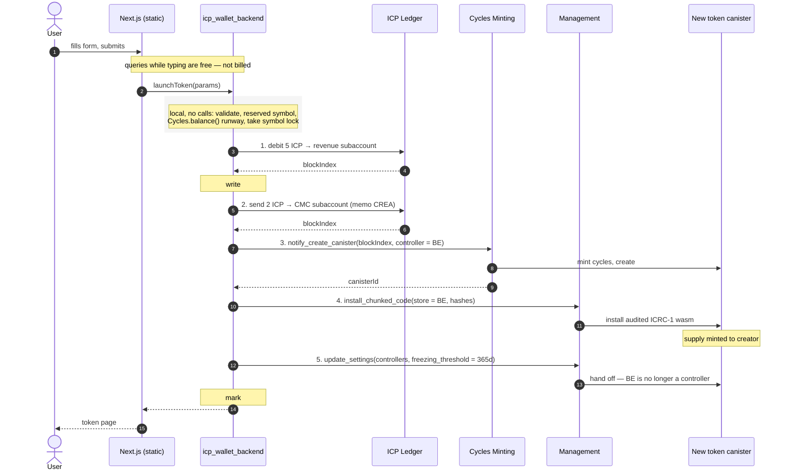
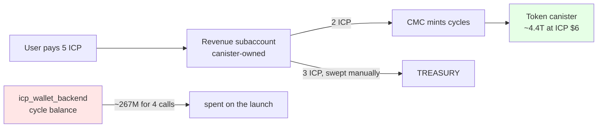
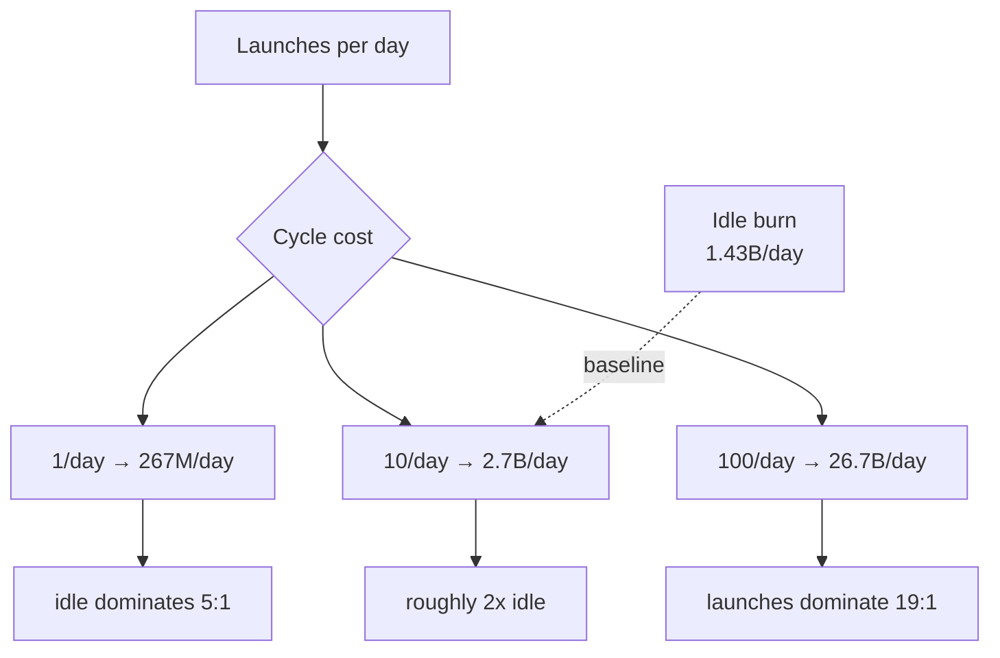
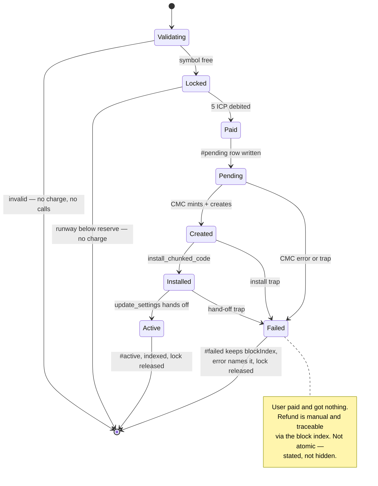
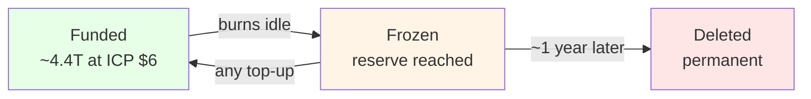

# Phase 4 — flow diagrams and canister load

Companion to [`here.md`](here.md) (decisions), [`code.md`](code.md)
(implementation) and [`flow.md`](flow.md) (the verified step-by-step). This file
answers one question: **what does a token launch cost `icp_wallet_backend`, and
what happens when many users launch at once?**

Cycle figures come from the measured baselines in `skills/icpay-ops`:

| | Measured |
|---|---|
| Update call | **66.8 M cycles** |
| Idle burn | **~1.43 B/day** |
| Queries | **not billed** |
| Rate source | CMC `xdr_permyriad_per_icp`; 1 XDR = 1 T cycles |

Everything below is arithmetic on those. **These are estimates. Measure
before/after on the first mainnet launch and replace this table with real
numbers** — the repo rule is measured values with a reduction percentage, never
projections, and this file is the one place projections are allowed to stand,
because the code does not exist yet.

---

## The launch, end to end



Steps 2–5 are the four calls a launch costs us. Step 1 is the user's payment.

---

## Where cycles actually go



**The two are not connected.** The child's 4.4 T comes from the CMC out of the
user's own fee. Our balance only pays for the four calls. That separation is the
whole point of routing through the CMC, and it is the property to verify on the
first mainnet launch.

---

## Cost per launch

Four update calls at the measured 66.8 M:

| Call | Cycles |
|---|---|
| ledger → CMC subaccount | 66.8 M |
| `notify_create_canister` | 66.8 M |
| `install_chunked_code` | 66.8 M |
| `update_settings` | 66.8 M |
| **Total** | **~267 M** |

At 1 ICP = 1.5278 T (the rate worked in the ops skill) and ICP at $6, 267 M
cycles ≈ **$0.001**. Against 3 ICP ≈ $18 of net revenue.

**Margin per launch is ~99.99% on cycles.** Cycle cost is not a business
constraint at any plausible volume. It is worth stating plainly so nobody
optimises the wrong thing: the reason to keep calls low is *latency and failure
surface*, not money.

The user's payment adds two more — `icrc1_fee` then `icrc1_transfer`, both inside
`TransferService` — for ~401 M across the whole invocation. That path already
exists for every send in the wallet and is not new load.
[`flow.md`](flow.md#worked-example) breaks it down call by call.

---

## Load at volume



| Launches/day | Launch cycles/day | vs idle (1.43 B) | Revenue/day |
|---|---|---|---|
| 1 | 267 M | 19% of idle | 3 ICP |
| 10 | 2.7 B | 1.9× idle | 30 ICP |
| 100 | 26.7 B | 19× idle | 300 ICP |
| 1,000 | 267 B | 187× idle | 3,000 ICP |

Even at 1,000 launches a day — far beyond anything realistic — the burn is 267 B
cycles/day against 3,000 ICP ≈ $18,000 of revenue. **Cycles never become the
limiting factor.** The 5 T `MIN_CYCLE_RESERVE` guard covers roughly 3,500 days of
idle burn, or ~18,000 launches back to back with no top-up.

**What does become limiting is storage and the `#active` scan**, not cycles:

- Each `Token` record is a few hundred bytes. 100,000 tokens is tens of MB against
  a 500 GB stable-memory ceiling — not a concern.
- `countActive` scans the token map on every `getPlatformStats`. It runs in a
  query so it is unbilled, but it is O(n) wall-clock. Past ~100 k tokens that
  query gets slow enough to notice, and the fix is an `#active` index — still not
  a counter.

---

## Per-user load

A single user launching a token costs them one update call and us four. There is
no per-user amplification: the symbol lock is held for one launch, and a second
concurrent launch by the same user on a different symbol proceeds independently.

What one user **cannot** do:

- **Spam launches to drain us.** Each attempt costs them 5 ICP. Draining the 5 T
  reserve at 267 M per launch takes ~18,000 launches = 90,000 ICP spent to burn
  ~$3 of our cycles.
- **Hold the lock open.** It is keyed by symbol and released on every exit path,
  including the `catch`.
- **Get a free token.** The debit precedes all canister work, so a failure after
  payment costs them money and yields nothing — which is why the `#failed` row
  keeps the block index for a manual refund.

---

## Failure paths



The three `Failed` transitions after `Paid` are the honest part of this design.
Motoko cannot roll back a completed ledger transfer when a later `await` traps, so
the plan keeps evidence instead of pretending atomicity.

---

## The token canister's own life

Separate from our load — this is the child's balance, funded by the user's 2 ICP.



| State | Queries | Transfers | Recoverable |
|---|---|---|---|
| Funded | yes | yes | — |
| Frozen | **yes** | no | **yes — any top-up** |
| Deleted | no | no | **no, if immutable** |

The 365-day `freezing_threshold` set at hand-off is what makes the middle state
last a year instead of a month. `notify_top_up` requires no controller rights, so
**any holder can rescue a frozen token**, not just the creator — which matters
because an immutable token has no controller at all.

---

## What to measure on the first mainnet launch

Replace the estimates above with real numbers:

```bash
export DFX_WARNING=-mainnet_plaintext_identity
npm run ci cycles:balance          # before
# ... perform one launch ...
npm run ci cycles:balance          # after
```

Two assertions:

1. **Delta ≈ 267 M**, not billions. Anything near the child's balance means the
   CMC path is not wired and launches are being paid out of the wallet.
2. **The child's balance ≈ what 2 ICP minted** at that moment's CMC rate.

Cap any test loop at 10–30 launches — update calls cost real cycles and this is
mainnet.
